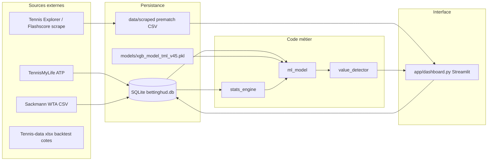

# Architecture BettingHUD — vue d’ensemble

Ce document décrit **l’organisation du dépôt**, les **flux de données** et la **logique d’exécution** (y compris l’automatisation). Le détail mathématique prédiction / Kelly / features est dans [`PREDICTION_ET_MISE.md`](PREDICTION_ET_MISE.md).

---

## 1. Rôle du système

BettingHUD est une application **locale** (principalement **Streamlit**) qui :

1. ingère l’historique tennis **ATP** (TennisMyLife) et **WTA** (Sackmann / Tennis Abstract) dans **SQLite** ;
2. scrape des **cotes prematch** et profils pour alimenter le **live** ;
3. entraîne ou charge un **modèle XGBoost calibré** (bundle `joblib`) ;
4. calcule des **probabilités**, de la **value (EV)** et une **reco de mise** (Kelly adaptatif Brier + plafonds) ;
5. suit un **portefeuille** et des **diagnostics** (Brier, ROI, CLV, etc.).

Aucun pari réel n’est passé automatiquement : l’outil **recommande** et **enregistre** ce que l’utilisateur valide.

---

## 2. Schéma logique (flux)

---

## 3. Arborescence utile

| Chemin | Rôle |
|--------|------|
| `app/dashboard.py` | UI Streamlit : live, backtest Kelly, portefeuille, diagnostics, human factors ; lance en arrière-plan **sync DB** et **train ML** périodiques (voir §6). |
| `scripts/stats_engine.py` | Stats joueur, identité, tactique 52 semaines, fatigue voyage, etc. |
| `scripts/ml_model.py` | Features, `prepare_data`, entraînement, `predict_match`, style KMeans, synergy tactique, persistance bundle. |
| `scripts/micro_elo_engine.py` | Micro-Elo service / retour (scan historique). |
| `scripts/sync_tours_daily.py` | Sync orchestrée **ATP + WTA** (appelée aussi depuis `update_model_tml.py`). |
| `scripts/sync_tml_recent.py` | Sync ciblée TML (utilitaire / historique). |
| `scripts/update_model_tml.py` | Pipeline : sync tours → entraînement → export `models/*.pkl`. |
| `scripts/backtest_2026.py` | Backtest no-leak, export CSV paris + colonnes `tournament`, `date` alignée tennis-data. |
| `scripts/backtest_staking_sim.py` | Simulation bankroll intra-jour (Kelly, cap, budget jour). |
| `scripts/bets_db.py` / `reconcile_bets.py` | Persistance paris, résultats, CLV. |
| `scripts/scraper_prematch.py` | Scrape cotes / liste matchs → `data/scraped/`. |
| `scripts/value_detector.py` | EV et pénalités confiance. |
| `scripts/surface_speed.py` / `weather_open_meteo.py` / `tournament_geo.py` | Vitesse surface, météo, géoloc tournois. |
| `docs/PREDICTION_ET_MISE.md` | Spécification prédiction + Kelly + limites. |
| `docs/ARCHITECTURE.md` | Ce fichier. |

Les dossiers `data/` et `models/` (gros binaires, CSV, DB) sont en principe **hors Git** (voir `.gitignore`) : chaque machine reconstruit via scripts + sauvegardes.

---

## 4. Base SQLite (conceptuel)

Les tables exactes évoluent avec le schéma ; typiquement :

- **Matchs** : `matches_recent` (ATP TML), `wta_matches` (WTA) ;
- **Paris / tracking** : tables dédiées (voir `bets_db.py`, migrations implicites dans le code) ;
- **Caches** : météo, cache joueurs live (`live_player_cache`), etc.

Le chemin par défaut du DB est partagé entre scripts (`ml_model.db_path`, etc.).

---

## 5. Bundle modèle ML

Fichier attendu en production : `models/xgb_model_tml_v45.pkl` (nom peut varier ; le dashboard teste plusieurs noms).

Le bundle contient notamment : estimateur(s) calibré(s), `features`, Elo et micro-Elo, `segment_brier_scores`, `global_test_brier`, objets **style** (KMeans, cartes), matrice **style×surface** si entraînée, etc.

**Invariant** : toute modification de liste ou d’ordre de `features` impose un **réentraînement** compatible.

---

## 6. Automatisation dans `dashboard.py`

Au démarrage du process Streamlit (threads daemon) :

| Mécanisme | Défaut | Variables d’environnement |
|-----------|--------|-----------------------------|
| Sync ATP+WTA `sync_tours_daily.py` | Actif ; 1er passage après ~120 s, puis **24 h** | `BETTINGHUD_AUTO_SYNC_TOURS`, `BETTINGHUD_AUTO_SYNC_INITIAL_DELAY_SEC`, `BETTINGHUD_AUTO_SYNC_INTERVAL_SEC` |
| Train `update_model_tml.py` | Actif ; 1er passage après **2 h**, puis **7 j** | `BETTINGHUD_AUTO_ML_TRAIN_WEEKLY`, `BETTINGHUD_AUTO_ML_TRAIN_INTERVAL_SEC`, `BETTINGHUD_AUTO_ML_TRAIN_INITIAL_DELAY_SEC` |
| Rafraîchissement prematch (subprocess scraper) | Actif si CSV trop vieux | `BETTINGHUD_PREMATCH_AUTO_REFRESH`, `BETTINGHUD_PREMATCH_TTL_MIN`, … |

**Limites** : si l’app n’est pas lancée, rien ne s’exécute ; les scrapers et sites tiers peuvent casser sans alerte native.

---

## 7. Dépendances externes

- **Réseau** : TennisMyLife, dépôts / fichiers WTA, sites de cotes, Open-Meteo (météo), etc.
- **Fichiers optionnels mais requis pour certains outils** : exports **tennis-data** (`data/raw/tennis_data/*.xlsx`, `data/raw/tennis_data_wta/*.xlsx`) pour le backtest bookmaker ; absence d’un fichier année → partie du backtest vide (ex. WTA sans cotes).

---

## 8. Sauvegardes

Le dépôt inclut `create_backup.py` (ZIP du projet, exclusions `venv`, `.git`, etc.). Des sauvegardes datées peuvent être placées sous `backups/` (dossier ignoré par Git). **La DB et les modèles** doivent être sauvegardés séparément si tu veux une restauration complète sur une autre machine.

---

## 9. Évolution recommandée (hors code)

Pour une autonomie longue durée : service OS (toujours actif), surveillance (alertes scraper/train), rotation des logs, sauvegardes DB planifiées — voir discussion produit dans les échanges récents du projet.

---

*Document à tenir à jour lors d’ajouts majeurs (nouveaux scripts, nouvelles tables, changement de pipeline d’entraînement).*
