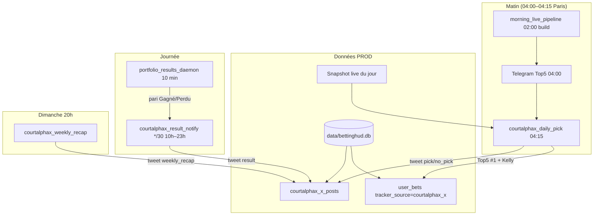

# CourtAlphaX — référence complète (compte public X)

> **⏸ Pause publication auto (juin 2026)** : `COURTALPHAX_X_ENABLED=0` sur PROD, crons commentés (`deploy/cron/courtalphax-x`, lignes X dans `acquisition-traffic`). Les scripts restent utilisables en `--dry-run`. Pour reprendre : `=1` + décommenter les crons + redéployer.

Compte dédié **CourtAlphaX** : bankroll virtuelle **100 €** (100 u), un pari « safe » par jour issu du **Top 5 proba** (Paris du jour), publication sur **X/Twitter**, puis tweet résultat + état BR + récap hebdomadaire.

> Voir aussi : [[TELEGRAM_TOP5]] · [[WEB_AUTH]] · [[SCHEDULE_MISES_A_JOUR]] · [[DEPLOY_SERVEUR]] · [[OPS_PROD_DEPANNAGE]] · `docs/env.courtalphax.example`

---

## Sommaire

1. [Vue d'ensemble & architecture](#1-vue-densemble--architecture)
2. [Règle métier — pick « le plus safe »](#2-règle-métier--pick-le-plus-safe)
3. [Flux quotidien & dépendances](#3-flux-quotidien--dépendances)
4. [Scripts — référence complète](#4-scripts--référence-complète)
5. [Base de données — `courtalphax_x_posts`](#5-base-de-données--courtalphax_x_posts)
6. [Modèles de tweets & hashtags](#6-modèles-de-tweets--hashtags)
7. [Variables d'environnement](#7-variables-denvironnement)
8. [Cron PROD (Europe/Paris)](#8-cron-prod-europeparis)
9. [Déploiement](#9-déploiement)
10. [Runbook opérationnel](#10-runbook-opérationnel)
11. [Coût API X](#11-coût-api-x)
12. [Checklist « prêt à publier »](#12-checklist-prêt-à-publier)
13. [Sécurité & rotation des credentials](#13-sécurité--rotation-des-credentials)
14. [Évolutions futures (non implémentées)](#14-évolutions-futures-non-implémentées)

---

## 1. Vue d'ensemble & architecture

### Identité du compte

| Élément | Valeur | Source |
|---------|--------|--------|
| Login web dashboard | `courtalphax` | `courtalphax_config.COURTALPHAX_USERNAME` |
| Nom affiché | `CourtAlpha X` | `COURTALPHAX_DISPLAY_NAME` |
| Rôle web | `user` (pas admin) | `init_courtalphax_account.py` |
| `telegram_user_id` logique | `9000000001` (défaut) | Scoping BR + paris — **pas un vrai utilisateur Telegram** |
| Capital initial | **100 €** | `COURTALPHAX_START_BR_EUR` |
| `tracker_source` en base | `courtalphax_x` | Filtre les paris publics X dans `user_bets` |

Le `telegram_user_id` est un identifiant **synthétique** : il permet de réutiliser toute la stack bankroll/Kelly du bot Telegram (`compute_telegram_user_bankroll_eur`, `kelly_stake_for_pick`, stats W/L) sans lier le compte à un chat Telegram réel.

### Schéma d'architecture



### Environnements

| Environnement | Rôle | Publication X |
|---------------|------|----------------|
| **PREPROD** (PC Windows local) | `--dry-run`, tests format | **Bloquée** (`BETTINGHUD_ENV != prod`) |
| **PROD** (`/opt/bettinghud`) | Cron + tweets réels | Credentials X + `COURTALPHAX_X_ENABLED=1` |

Comme Telegram : picks depuis le **snapshot PROD**, paris dans `data/bettinghud.db` PROD, tweets depuis le cron PROD.

---

## 2. Règle métier — pick « le plus safe »

Aligné sur **Paris du jour / Top 5** (`collect_daily_ev_band_picks` + `filter_telegram_display_picks` dans `telegram_top5_notify.py`) :

1. Matchs du **jour calendrier Europe/Paris**
2. **Main draw** ATP/WTA uniquement (filtre hérité du pool daily)
3. Bande EV favori **15 % – 100 %** (hardcodé dans `courtalphax_daily_pick.py`)
4. Filtre affichage Telegram : **proba modèle > 60 %** et **EV > 15 %** (seuils `TELEGRAM_MIN_PROBA_PCT` / `TELEGRAM_MIN_EV_PCT`, défaut 60/15)
5. Tri **proba modèle favori ↓** → **rank #1 = le plus safe**

**Mise** : ½ Kelly × segment Brier, plafonnée comme le bot Telegram (`kelly_stake_for_pick`), sur la **BR disponible CourtAlphaX**.

**Cote publiée** : `odd_fav` ou `odd_book` du snapshot au moment de la publication (même logique que `/top5` matinal).

**Garde-fous journaliers** :

- **1 seul brief / jour** : `daily_pick` **ou** `no_pick` (index unique SQLite + vérif pari existant)
- Si aucun pick → tweet **« pas de pick value »** (aucun enregistrement dans `user_bets`)
- Si mise Kelly < 0,01 € → abandon silencieux (`reason: stake_zero`)
- Si cote ≤ 1,0 → abandon (`reason: bad_odd`)

---

## 3. Flux quotidien & dépendances

| Moment (Paris) | Job | Script | Dépend de |
|----------------|-----|--------|-----------|
| **02:00** | Build snapshot matin | `morning_live_pipeline.py --build-only` | Scraper TE, modèle ML |
| **04:00** | Top 5 Telegram | `morning_live_pipeline.py --telegram-only` | Snapshot 02:00 |
| **04:05 / 04:10** | Vérif scrape + snapshot | `courtalphax_preflight.py` | Logs seulement |
| **04:15** (+ 04:30, 05:00) | Pick safe ou « pas de value » | `courtalphax_daily_pick.py` | Snapshot + Top5 logic |
| **Toutes les 10 min** | Règlement paris | `portfolio_results_daemon` (systemd) | API résultats matchs |
| **10h–23h, */30 min** | Tweet résultat + BR | `courtalphax_result_notify.py` | Paris réglés + daemon |
| **Dimanche 20:00** | Récap semaine lun–dim | `courtalphax_weekly_recap.py` | `user_bets` + `no_pick` logs |

**Ordre critique le matin** : le cron CourtAlphaX à **04:15** part **après** le pipeline Telegram **04:00**, pour garantir un snapshot frais.

---

## 4. Scripts — référence complète

### Modules partagés (pas de CLI)

| Fichier | Rôle |
|---------|------|
| `scripts/courtalphax_config.py` | Constantes : username, `telegram_user_id`, BR start, `tracker_source` |
| `scripts/x_client.py` | Client API X v2 : `post_tweet`, `delete_tweet`, garde `require_prod_for_x_post`, troncature 280 car. |
| `scripts/courtalphax_format.py` | Templates tweets + logique hashtags (`_embed_hashtags`) |
| `scripts/courtalphax_post_log.py` | Schéma SQLite, journal anti-doublons, claim/release résultats |

### Scripts exécutables

#### `scripts/init_courtalphax_account.py` — création compte (une fois)

Crée l'utilisateur web `courtalphax` + initialise la BR de départ dans SQLite.

```powershell
py -3 scripts/init_courtalphax_account.py --password "VotreMotDePasse"
py -3 scripts/init_courtalphax_account.py --password "…" --email "court@example.com"
py -3 scripts/init_courtalphax_account.py --dry-run
```

| Flag | Description |
|------|-------------|
| `--password` | Mot de passe web (sinon invite interactive) |
| `--email` | E-mail optionnel (reset MDP via [[WEB_AUTH]]) |
| `--start-br` | Capital initial (défaut : `COURTALPHAX_START_BR_EUR` = 100) |
| `--db` | Chemin SQLite (défaut : `data/bettinghud.db`) |
| `--dry-run` | Aperçu sans écriture |

**Écrit** : `web_users.json` (via `web_auth.upsert_web_user`) + `bets_meta` start BR.

---

#### `scripts/courtalphax_init_br.py` — réinitialiser la BR

Utilitaire ponctuel : remet la BR de départ sans toucher au compte web.

```powershell
py -3 scripts/courtalphax_init_br.py
```

Affiche la BR disponible après `set_telegram_user_start_br`.

---

#### `scripts/courtalphax_preflight.py` — vérif scrape + snapshot

Contrôle que le pipeline matin (02:00) a bien tourné avant le tweet pick :

- pas de build snapshot en cours
- dernier CSV TE (`data/scraped/*.csv`) du jour, âge ≤ 150 min (défaut)
- snapshot full du jour, ≥ 1 match, âge ≤ 150 min

```powershell
py -3 scripts/courtalphax_preflight.py
py -3 scripts/courtalphax_preflight.py --json
```

| Variable | Défaut | Rôle |
|----------|--------|------|
| `COURTALPHAX_MAX_SNAPSHOT_AGE_MIN` | `150` | Âge max snapshot (min) |
| `COURTALPHAX_MAX_SCRAPE_AGE_MIN` | `150` | Âge max CSV TE (min) |

**Exit** : `0` si prêt, `1` si KO. Intégré dans `courtalphax_daily_pick.py` (sauf `--dry-run`, `--force`, `--skip-preflight`).

---

#### `scripts/courtalphax_daily_pick.py` — pick du jour

Top5 #1 → Kelly → tweet → enregistrement `user_bets` (ou tweet `no_pick`).

```powershell
py -3 scripts/courtalphax_daily_pick.py --dry-run
py -3 scripts/courtalphax_daily_pick.py
py -3 scripts/courtalphax_daily_pick.py --force   # hors PROD, déconseillé
```

| Flag | Description |
|------|-------------|
| `--dry-run` | Aperçu tweet en console, pas d'appel API ni de pari |
| `--force` | Bypass garde `BETTINGHUD_ENV=prod` ; ne contourne **pas** l'anti-doublon journalier |
| `--skip-preflight` | Ignorer vérif scrape/snapshot (déconseillé) |

**Codes de sortie** : `1` si `already_posted`, `2` si `not_ready` (preflight), `0` sinon.

**Dépendances** : `telegram_top5_notify._load_top5_context`, `telegram_bet_flow.kelly_stake_for_pick`, `bets_db.save_bet_enriched`.

---

#### `scripts/courtalphax_result_notify.py` — tweets résultat

Publie un tweet par pari **Gagné/Perdu** non encore notifié, avec P/L et état BR cumulé.

```powershell
py -3 scripts/courtalphax_result_notify.py --dry-run
py -3 scripts/courtalphax_result_notify.py
```

| Flag | Description |
|------|-------------|
| `--dry-run` | Affiche les tweets en attente sans publier |
| `--force` | Bypass garde PROD |

Traite **tous** les paris en attente dans l'ordre `bet_id ASC`. Recalcule BR/stats après chaque publication.

---

#### `scripts/courtalphax_weekly_recap.py` — récap dimanche

Semaine calendaire **lun–dim** (clé `YYYY-MM-DD_YYYY-MM-DD`).

```powershell
py -3 scripts/courtalphax_weekly_recap.py --dry-run
py -3 scripts/courtalphax_weekly_recap.py
py -3 scripts/courtalphax_weekly_recap.py --force   # republier même semaine
```

| Flag | Description |
|------|-------------|
| `--dry-run` | Aperçu sans tweet |
| `--force` | Ignore le garde « récap déjà publié » pour la semaine courante |

---

#### `scripts/courtalphax_delete_tweet.py` — suppression ponctuelle

Supprime un tweet par ID via l'API X (`DELETE /2/tweets/:id`).

```powershell
py -3 scripts/courtalphax_delete_tweet.py                    # ID test par défaut
py -3 scripts/courtalphax_delete_tweet.py 1234567890
py -3 scripts/courtalphax_delete_tweet.py 1234567890 --dry-run
```

| Argument | Description |
|----------|-------------|
| `tweet_id` (optionnel) | ID du tweet ; défaut hardcodé dans le script |
| `--dry-run` | Simule sans appeler l'API |

> Ne supprime **pas** l'entrée dans `courtalphax_x_posts` — à faire manuellement si besoin.

---

#### `scripts/test_x_credentials.py` — test OAuth 1.0a

Vérifie les 4 variables OAuth 1.0a via `GET /2/users/me` (**sans publier**).

```powershell
py -3 scripts/test_x_credentials.py
```

**Limitation** : ne teste **que OAuth 1.0a** (`X_API_KEY`, `X_API_SECRET`, `X_ACCESS_TOKEN`, `X_ACCESS_TOKEN_SECRET`). Pour OAuth 2.0 Bearer (`X_USER_ACCESS_TOKEN`), tester avec `courtalphax_daily_pick.py --dry-run` puis un tweet réel contrôlé.

---

#### `scripts/x_client.py` — fonctions clés

| Fonction | Rôle |
|----------|------|
| `x_posting_enabled()` | `COURTALPHAX_X_ENABLED` ∈ {1, true, yes} |
| `is_prod_env()` | `BETTINGHUD_ENV == prod` |
| `require_prod_for_x_post(force, dry_run)` | Bloque publication hors PROD |
| `post_tweet(text, dry_run)` | POST `/2/tweets` — OAuth2 Bearer prioritaire, sinon OAuth1 |
| `delete_tweet(tweet_id, dry_run)` | DELETE `/2/tweets/:id` |
| `truncate_tweet(text)` | Coupe à 280 caractères avec « … » |

---

## 5. Base de données — `courtalphax_x_posts`

Table gérée par `courtalphax_post_log.ensure_courtalphax_x_schema()` — créée automatiquement au premier usage.

### Schéma

```sql
CREATE TABLE courtalphax_x_posts (
    id INTEGER PRIMARY KEY AUTOINCREMENT,
    post_type TEXT NOT NULL,       -- daily_pick | no_pick | result | weekly_recap
    calendar_date TEXT,            -- jour ISO ou clé semaine YYYY-MM-DD_YYYY-MM-DD
    bet_id INTEGER,                -- lien user_bets (pick + result)
    tweet_id TEXT,                 -- ID X renvoyé par l'API
    tweet_text TEXT,               -- copie du texte publié
    created_at TEXT NOT NULL DEFAULT (datetime('now'))
);
```

### Index uniques (anti-doublons)

| Index | Condition | Effet |
|-------|-----------|-------|
| `idx_cax_daily_pick` | `post_type='daily_pick'` + `calendar_date` | 1 pick publié / jour |
| `idx_cax_no_pick` | `post_type='no_pick'` + `calendar_date` | 1 tweet « pas de value » / jour |
| `idx_cax_result_bet` | `post_type='result'` + `bet_id` | 1 tweet résultat / pari |
| `idx_cax_weekly_recap` | `post_type='weekly_recap'` + `calendar_date` | 1 récap / semaine |

### Logique anti-doublon — pick du jour

`courtalphax_daily_pick.py` refuse de republier si :

1. `has_daily_post_for_date(cal_day)` — entrée `daily_pick` **ou** `no_pick` existe déjà
2. **OU** `_existing_bet_today()` — pari `courtalphax_x` déjà en base pour ce jour

Sauf `--force` sur l'environnement (pas sur l'anti-doublon journalier).

### Logique anti-doublon — tweet résultat (race cron)

1. `fetch_bets_pending_result_post()` : paris `Gagné`/`Perdu` sans entrée `result`
2. `try_claim_result_post(bet_id)` : INSERT conditionnel **avant** l'appel API
3. `post_tweet()` → succès → `finalize_result_post()` (remplit `tweet_id`, `tweet_text`)
4. Échec API → `release_result_post_claim()` (DELETE la réservation sans `tweet_id`)

### Requêtes utiles

```sql
-- Briefs du jour
SELECT * FROM courtalphax_x_posts
WHERE calendar_date = date('now') AND post_type IN ('daily_pick','no_pick');

-- Résultats en attente de tweet
SELECT b.id, b.bet_on, b.status FROM user_bets b
WHERE b.telegram_user_id = '9000000001'
  AND b.tracker_source = 'courtalphax_x'
  AND b.status IN ('Gagné','Perdu')
  AND NOT EXISTS (
    SELECT 1 FROM courtalphax_x_posts p
    WHERE p.post_type = 'result' AND p.bet_id = b.id
  );

-- Historique complet
SELECT post_type, calendar_date, bet_id, tweet_id, created_at
FROM courtalphax_x_posts ORDER BY id DESC LIMIT 20;
```

### Table `user_bets` (paris CourtAlphaX)

Champs clés au moment du pick (`save_bet_enriched`) :

- `telegram_user_id` = `COURTALPHAX_TELEGRAM_USER_ID`
- `tracker_source` = `courtalphax_x`
- `match_date`, `bet_on`, `odds`, `stake`, `p_model`, `ev_at_bet`, `notes` = `CourtAlphaX pick #N`

---

## 6. Modèles de tweets & hashtags

> **Règle API X (2026)** : texte seul ≈ **0,015 $/tweet** ; tweet **avec URL** ≈ **0,20 $**. Aucun lien n'est inséré volontairement.

Tous les tweets se terminent par : `Info — pas un conseil financier. BR virtuelle.`

### Hashtags (`courtalphax_format.py`)

| Type de tweet | Tags ajoutés |
|---------------|--------------|
| Toujours | `#CourtAlpha` `#ValueBetting` |
| Pick / résultat | + tag tournoi si reconnu + `#ATPTour` / `#WTATour` |
| Pas de pick / récap | + `#Tennis` |

**Priorité si > 280 caractères** (`_embed_hashtags`) : retire d'abord le dernier tag optionnel (tournoi ou circuit), jamais la marque ni `#ValueBetting`. Dernier recours : tweet sans hashtags, disclaimer conservé.

**Tournois reconnus** (extrait) : Roland-Garros, Wimbledon, US Open, Aus Open, Indian Wells, Miami, Monte-Carlo, Madrid, Rome, Cincinnati, Shanghai, Paris Masters, Queens, Halle, Barcelona, etc.

### Pick du jour (`format_daily_pick_tweet`)

```
🎾 CourtAlpha — pick #127 (2026-06-05)

Alcaraz vs Sinner
Proba 71% · EV +18% · @1.42
Mise Kelly : 4.20 € (4.2% BR)
Roland-Garros · terre · ATP · 15:00

BR virtuelle : 100.00 € (start 100 €)
Info — pas un conseil financier. BR virtuelle.

#CourtAlpha #ValueBetting #RolandGarros #ATPTour
```

### Pas de pick (`format_no_pick_tweet`)

```
🎾 CourtAlpha — 2026-06-05

Pas de pick value aujourd'hui.
Filtres : proba > 60 % · EV 15–100 % · main draw ATP/WTA.
42 match(s) scannés · jour sans mise.

BR virtuelle : 100.00 € (start 100 €)
Info — pas un conseil financier. BR virtuelle.

#CourtAlpha #ValueBetting #Tennis
```

### Résultat (`format_result_tweet`)

```
✅ Gagné — Alcaraz @1.42
P/L : +2.57 € · mise 4.20 €

📊 BR CourtAlphaX : 102.57 € (+2.6%)
Record : 12W-8L · ROI +8.4%
Info — pas un conseil financier. BR virtuelle.

#CourtAlpha #ValueBetting #RolandGarros #ATPTour
```

### Récap hebdomadaire (`format_weekly_recap_tweet`)

Semaine **lun–dim**. Si le détail dépasse 280 caractères, une **version compacte** est générée automatiquement.

```
📊 CourtAlpha — récap semaine 2–8 juin

Paris : 5 · 3W-2L
P/L semaine : +4.20 € · ROI +12%
Jours sans pick : 2

✅ 06-03 Alcaraz @1.42 +2.57€
❌ 06-04 Swiatek @1.55 -3.10€
…

BR virtuelle : 104.20 € (+4.2%)
Info — pas un conseil financier. BR virtuelle.

#CourtAlpha #ValueBetting #Tennis
```

---

## 7. Variables d'environnement

Fichier modèle : `docs/env.courtalphax.example` → copier vers `.env` (**ne jamais committer**).

### CourtAlphaX

| Variable | Défaut | Rôle |
|----------|--------|------|
| `COURTALPHAX_X_ENABLED` | `0` | `1` pour autoriser POST/DELETE API X |
| `COURTALPHAX_TELEGRAM_USER_ID` | `9000000001` | Scope BR + paris |
| `COURTALPHAX_START_BR_EUR` | `100` | Capital initial affiché dans les tweets |
| `BETTINGHUD_ENV` | `preprod` | Doit être `prod` pour publier (sauf `--dry-run` / `--force`) |

### API X — OAuth 2.0 (recommandé)

| Variable | Rôle |
|----------|------|
| `X_USER_ACCESS_TOKEN` | Bearer user token (prioritaire) |
| `X_OAUTH2_ACCESS_TOKEN` | Alias accepté |
| `X_ACCESS_TOKEN_BEARER` | Alias accepté |

**Scopes requis** : `tweet.read`, `tweet.write`, `users.read`.

### API X — OAuth 1.0a (alternative)

| Variable | Alias accepté |
|----------|---------------|
| `X_API_KEY` | `X_CONSUMER_KEY` |
| `X_API_SECRET` | `X_CONSUMER_SECRET` |
| `X_ACCESS_TOKEN` | — |
| `X_ACCESS_TOKEN_SECRET` | — |

Dépendance : `requests-oauthlib` (dans `requirements.txt`).

### Filtres hérités Telegram (optionnel)

| Variable | Défaut | Impact sur CourtAlphaX |
|----------|--------|------------------------|
| `TELEGRAM_MIN_PROBA_PCT` | `60` | Seuil proba minimum |
| `TELEGRAM_MIN_EV_PCT` | `15` | Seuil EV minimum |

---

## 8. Cron PROD (Europe/Paris)

Fichier source : `deploy/cron/courtalphax-x`  
Destination serveur : `/etc/cron.d/bettinghud-courtalphax-x`

```cron
CRON_TZ=Europe/Paris
# 02:00 — pipeline matin (deploy/cron/morning-pipeline) : scrape TE + snapshot
# 04:00 — Telegram Top 5 (snapshot déjà prêt)
# 04:05 / 04:10 — vérif preflight (logs)
5 4 * * * ubuntu cd /opt/bettinghud && /opt/bettinghud/venv/bin/python scripts/courtalphax_preflight.py >> /opt/bettinghud/data/logs/courtalphax_x.log 2>&1
10 4 * * * ubuntu cd /opt/bettinghud && /opt/bettinghud/venv/bin/python scripts/courtalphax_preflight.py >> /opt/bettinghud/data/logs/courtalphax_x.log 2>&1
# 04:15 / 04:30 / 05:00 — pick (preflight intégré ; retry si build tardif)
15 4 * * * ubuntu cd /opt/bettinghud && /opt/bettinghud/venv/bin/python scripts/courtalphax_daily_pick.py >> /opt/bettinghud/data/logs/courtalphax_x.log 2>&1
30 4 * * * ubuntu cd /opt/bettinghud && /opt/bettinghud/venv/bin/python scripts/courtalphax_daily_pick.py >> /opt/bettinghud/data/logs/courtalphax_x.log 2>&1
0 5 * * * ubuntu cd /opt/bettinghud && /opt/bettinghud/venv/bin/python scripts/courtalphax_daily_pick.py >> /opt/bettinghud/data/logs/courtalphax_x.log 2>&1
# Toutes les 30 min (10h–23h) — tweet résultat
*/30 10-23 * * * ubuntu cd /opt/bettinghud && /opt/bettinghud/venv/bin/python scripts/courtalphax_result_notify.py >> /opt/bettinghud/data/logs/courtalphax_x.log 2>&1
# Dimanche 20:00 — récap semaine
0 20 * * 0 ubuntu cd /opt/bettinghud && /opt/bettinghud/venv/bin/python scripts/courtalphax_weekly_recap.py >> /opt/bettinghud/data/logs/courtalphax_x.log 2>&1
```

| Job | Horaire | Log |
|-----|---------|-----|
| Vérif preflight | **04:05** et **04:10** | `data/logs/courtalphax_x.log` |
| Pick quotidien | **04:15**, retry **04:30** / **05:00** | idem |
| Résultats | ***/30 de 10h à 23h** | idem |
| Récap hebdo | **Dimanche 20:00** | idem |

**Preflight** (`courtalphax_preflight.py`) avant le pick : CSV TE du jour (< 150 min par défaut), snapshot full reconstruit aujourd'hui (< 150 min), pas de build en cours. Variables : `COURTALPHAX_MAX_SNAPSHOT_AGE_MIN`, `COURTALPHAX_MAX_SCRAPE_AGE_MIN`. Le pick refuse de tweeter si KO (exit 2) — anti-doublon empêche un double tweet au retry.

**Chaîne matin** : scrape TE + snapshot **02:00** → Telegram Top 5 **04:00** → vérif **04:05/04:10** → pick X **04:15+**.

**Prérequis systemd** : `bettinghud-daemon` (`portfolio_results_daemon`) actif pour régler les paris avant les tweets résultat.

---

## 9. Déploiement

### 9.1 Préparation `.env` PROD

Sur le serveur `/opt/bettinghud/.env` (permissions `600`) :

```env
BETTINGHUD_ENV=prod
COURTALPHAX_X_ENABLED=1
COURTALPHAX_TELEGRAM_USER_ID=9000000001
COURTALPHAX_START_BR_EUR=100
X_USER_ACCESS_TOKEN=…
```

### 9.2 Compte CourtAlphaX en base PROD

```bash
ssh bettinghud
cd /opt/bettinghud
/opt/bettinghud/venv/bin/python scripts/init_courtalphax_account.py --password "…"
```

### 9.3 Git pull + cron

```bash
ssh bettinghud
cd /opt/bettinghud && git pull

# Installer le cron (LF obligatoire — pas de CRLF Windows)
sudo cp deploy/cron/courtalphax-x /etc/cron.d/bettinghud-courtalphax-x
sudo sed -i 's/\r$//' /etc/cron.d/bettinghud-courtalphax-x
sudo chmod 644 /etc/cron.d/bettinghud-courtalphax-x

# Vérifier
cat /etc/cron.d/bettinghud-courtalphax-x
```

> Même règle LF que `bettinghud-morning-pipeline` — voir [[OPS_PROD_DEPANNAGE]] § cron CRLF.

### 9.4 Tests PREPROD (Windows)

```powershell
cd O:\Miouppy\Documents\BettingHUD
py -3 scripts/courtalphax_daily_pick.py --dry-run
py -3 scripts/courtalphax_result_notify.py --dry-run
py -3 scripts/courtalphax_weekly_recap.py --dry-run
```

### 9.5 Premier tweet PROD

```bash
ssh bettinghud
cd /opt/bettinghud
/opt/bettinghud/venv/bin/python scripts/courtalphax_daily_pick.py
tail -20 data/logs/courtalphax_x.log
```

---

## 10. Runbook opérationnel

### Commandes de diagnostic

```powershell
# BR CourtAlphaX
py -3 -c "import sqlite3; from scripts.bets_db import compute_telegram_user_bankroll_eur; from scripts.courtalphax_config import COURTALPHAX_TELEGRAM_USER_ID as u; c=sqlite3.connect('data/bettinghud.db'); print(compute_telegram_user_bankroll_eur(c,u)); c.close()"

# Test credentials OAuth 1.0a
py -3 scripts/test_x_credentials.py

# Aperçu tweets sans publier
py -3 scripts/courtalphax_daily_pick.py --dry-run
py -3 scripts/courtalphax_result_notify.py --dry-run
py -3 scripts/courtalphax_weekly_recap.py --dry-run
```

```bash
# Logs PROD
ssh bettinghud "tail -50 /opt/bettinghud/data/logs/courtalphax_x.log"

# Daemon résultats actif ?
ssh bettinghud "systemctl is-active bettinghud-daemon"
```

### Scénarios courants

| Symptôme | Cause probable | Action |
|----------|----------------|--------|
| `BETTINGHUD_ENV != prod` | Lancement depuis PREPROD | Normal — utiliser `--dry-run` ou exécuter sur PROD |
| `COURTALPHAX_X_ENABLED=1 requis` | Flag absent en prod | Ajouter dans `/opt/bettinghud/.env`, pas de redémarrage requis |
| `Brief du jour déjà publié` | Anti-doublon journalier | Attendre le lendemain ; vérifier `courtalphax_x_posts` |
| `X API 401/403` | Token expiré ou scopes manquants | Régénérer token, vérifier `tweet.write` |
| `X API 402` | Crédits developer épuisés | Recharger sur developer.x.com |
| Pas de tweet résultat | Pari pas encore réglé | Vérifier `portfolio_results_daemon` + statut `user_bets` |
| Tweet résultat en double | Très rare (race) | Vérifier index `idx_cax_result_bet` ; claim/release dans les logs |
| Récap déjà publié | Normal le dimanche | `--force` si republication voulue (exceptionnel) |

### Supprimer un tweet publié par erreur

```bash
# 1. Supprimer sur X
/opt/bettinghud/venv/bin/python scripts/courtalphax_delete_tweet.py <tweet_id>

# 2. (Optionnel) Nettoyer le journal SQLite
sqlite3 data/bettinghud.db "DELETE FROM courtalphax_x_posts WHERE tweet_id='<tweet_id>';"
```

### Réinitialiser la BR (sans effacer l'historique des paris)

```bash
/opt/bettinghud/venv/bin/python scripts/courtalphax_init_br.py
```

---

## 11. Coût API X

Modèle **pay-per-use** ([docs officielles](https://docs.x.com/x-api/getting-started/pricing)) :

| Action | Coût unitaire |
|--------|----------------|
| Créer un post (texte / média) | **0,015 $** |
| Créer un post **avec URL** | **0,200 $** |
| Lire ses propres posts | **0,001 $** |
| Supprimer un post | Inclus dans `tweet.write` |

**Estimation CourtAlphaX** (sans URL) :

| Scénario | Posts/mois | Coût estimé |
|----------|------------|-------------|
| ~1 pick + ~1 résultat / jour ouvré | ~44 | **~0,66 $/mois** |
| + récap hebdo (4/mois) | ~48 | **~0,72 $/mois** |
| Jours sans pick fréquents (+ tweets no_pick) | ~60 | **~0,90 $/mois** |

Très abordable en pay-per-use. Éviter le tier legacy Basic (200 $/mois) sauf abonnement existant.

---

## 12. Checklist « prêt à publier »

1. [ ] Compte développeur X + crédits actifs
2. [ ] Tokens dans `/opt/bettinghud/.env` + `COURTALPHAX_X_ENABLED=1` + `BETTINGHUD_ENV=prod`
3. [ ] `init_courtalphax_account.py` exécuté sur PROD (BR 100 €)
4. [ ] `courtalphax_daily_pick.py --dry-run` OK en PREPROD (format tweet)
5. [ ] `test_x_credentials.py` OK **ou** test OAuth2 avec dry-run PROD
6. [ ] `courtalphax_daily_pick.py` → 1er tweet réel PROD
7. [ ] Cron installé (`bettinghud-courtalphax-x`) + fichier en **LF**
8. [ ] `bettinghud-daemon` actif (`portfolio_results_daemon`)
9. [ ] `courtalphax_result_notify.py` testé après un pari réglé
10. [ ] `courtalphax_weekly_recap.py --dry-run` avant le premier dimanche

---

## 13. Sécurité & rotation des credentials

| Règle | Détail |
|-------|--------|
| **Ne jamais committer** | `.env`, tokens X, mots de passe |
| **Permissions PROD** | `.env` en `chmod 600`, propriétaire `ubuntu` |
| **PREPROD** | Pas de tokens X nécessaires pour `--dry-run` |
| **Rotation** | Régénérer `X_USER_ACCESS_TOKEN` (ou paire OAuth1) sur incident ; mettre à jour `.env` PROD uniquement |
| **Révocation** | Révoquer l'ancien token côté developer.x.com après rotation |
| **Audit** | Table `courtalphax_x_posts` conserve `tweet_id` + `tweet_text` pour traçabilité |
| **Compte web** | Mot de passe `courtalphax` distinct du token X ; reset via [[WEB_AUTH]] |
| **`--force`** | Contourne le garde PROD — réserver aux tests exceptionnels |
| **Conformité tweets** | Disclaimer sur chaque post ; pas de promesse de gain ; CGU X (pas de spam) |

---

## 14. Évolutions futures (non implémentées)

| Idée | Statut |
|------|--------|
| Onglet admin « CourtAlpha X » (dernier tweet, BR, dry-run) | Phase 4 — non codé |
| Re-scrape cote juste avant tweet | Option mentionnée, non implémentée |
| Script `test_x_credentials` pour OAuth 2.0 Bearer | Manquant — OAuth1 seulement |
| Tâche planifiée Windows (`register_courtalphax_task.ps1`) | Non créée (cron Linux uniquement) |
| Mention dans [[SCHEDULE_MISES_A_JOUR]] / [[DEPLOY_SERVEUR]] | À ajouter si souhaité (lien vers cette note) |

---

## Commandes rapides (récap)

```powershell
# Créer le compte (PREPROD ou PROD)
py -3 scripts/init_courtalphax_account.py --password "…"

# Aperçu pick du jour
py -3 scripts/courtalphax_daily_pick.py --dry-run

# BR CourtAlphaX
py -3 -c "from scripts.courtalphax_config import COURTALPHAX_TELEGRAM_USER_ID as u; import sqlite3; from scripts.bets_db import compute_telegram_user_bankroll_eur as f; c=sqlite3.connect('data/bettinghud.db'); print(f(c, u))"
```

```bash
# PROD — suivre les tweets
tail -f /opt/bettinghud/data/logs/courtalphax_x.log
```
