# Crons PROD — vue hebdomadaire

Dernière mise à jour : **28 août 2026** · fuseau **`Europe/Paris`**.

Serveur : **`bettinghud`** (`/opt/bettinghud`). Fichiers source : `deploy/cron/*` → `/etc/cron.d/bettinghud-*`.

> **Timezone (important)** : le cron Ubuntu (vixie) **ignore `CRON_TZ` pour le scheduling** — les heures sont interprétées dans le **fuseau système**. Depuis le **16/07/2026**, le serveur est en **`Europe/Paris`** (`timedatectl set-timezone Europe/Paris`, aussi dans `deploy/install_ubuntu.sh`). `CRON_TZ=Europe/Paris` reste dans les fichiers cron (doc / env des jobs), mais **ne suffit pas** si le système est en UTC.

> **Hors cron** : services systemd **24/7** (`bettinghud-telegram-bot`, `bettinghud-daemon`, `bettinghud-dashboard` avec `BETTINGHUD_LIVE_DATA_DAEMON=1`).  
> **PREPROD (PC Windows)** : pipeline matin et backup DB via tâches planifiées — voir [[ENVIRONNEMENTS]].

---

## Autonomie PROD — sans intervention manuelle

Ce qui **tourne tout seul** sur le serveur `bettinghud` (crons + systemd). Tu n’as pas besoin d’ouvrir le dashboard ni CourtAlpha pour que ces jobs s’exécutent.

| Besoin | Mécanisme | Fréquence |
|--------|-----------|-----------|
| **Scrape TE + snapshot enrichi (ML live)** | Cron `morning-pipeline` 04:30 + thread `live-data-daemon` (dashboard systemd) | **04:30** build · refresh snapshot ~**15 min** |
| **Projection « jour » live** | `is_today_paris_match` | début **J 00:00 → J+1 05:00** Paris |
| **Sync historique ATP/WTA + ingest SQLite** | Cron `data-sync` → `sync_tours_daily.py` | **00:30** quotidien (~4 h max observé) |
| **Réentraînement ML** | Cron `data-sync` → `update_model_tml.py` | **Sam 23:00** |
| **Rapport ML / Brier (admin TG)** | Cron `ml-weekly-telegram` | **Lun 08:00** |
| **Publications matin** (Top 5, 1D1P, canal) | Cron `morning-pipeline --publish-only` | **05:00** (~1 min) |
| **Backup archive WTA** (tarball) | Cron `wta-sackmann-backup` | **Dim 00:15** |
| **Bot Telegram** (`/jour`, `/top5`, Parier) | `bettinghud-telegram-bot.service` | **24/7** |
| **Résultats paris + top probas jour** | `bettinghud-daemon.service` | **~10 min** |

**Logs de contrôle** : `tours_auto_sync.log` (sync 00:30), `ml_train_cron.log` (sam.), `morning_publish_cron.log`, `telegram_bot_daemon.log`.

> **CourtAlpha (Settings)** : certains pipelines affichent encore « thread dashboard » — en PROD la **source de vérité est le cron** (`deploy/cron/data-sync`, `morning-pipeline`), pas une visite UI Streamlit `:8501`.

### Ce qui n’est **pas** 100 % autonome

| Élément | Pourquoi | Action si besoin |
|---------|----------|------------------|
| **Backup DB SQLite prod → PC** | Tâche Windows `BettingHUD-Prod-DB-Backup` (~05:30) — le **PC doit être allumé** | `scripts\register_prod_backup_task.ps1` · voir [[ENVIRONNEMENTS]] |
| **Déploiement code / hotfix** | Pas de CD automatique | `git pull` + `systemctl restart …` sur prod |
| **Scrape TE en journée** | Cron garantit **02:00 + 05:00** seulement ; pas de rescrape toutes les 20 min hors dashboard | Normal entre deux crons ; badge CourtAlpha « Scraper TE » peut passer en warn/error (seuils UI) |
| **Threads dashboard** (sync tours / ML) | Redondants si crons OK ; ne démarrent que si Streamlit tourne | Ne pas s’y fier seul — vérifier les crons |

---

## Semaine type (synthèse)

| Jour | Crons actifs (heure Paris) |
|------|----------------------------|
| **Lun → Sam** | 00:30 sync · 04:15 backup · 04:30 build · 04:56 preflight · 04:58 OG · **05:00 publications** · ***/2 min** billing |
| **Lundi** | **08:00** rapport ML + Brier WTA → admin Telegram |
| **Dimanche** | **+** 00:15 backup WTA · 04:10 aliases rangs · **Sam 23:00** retrain ML · 10:00 récap TG · 11:00 brouillon Reddit · 18:00 rapport trafic |

```mermaid
gantt
    title PROD — chaîne matin (lun–sam, heures Paris)
    dateFormat HH:mm
    axisFormat %H:%M
    section Nuit
    Sync ATP+WTA+ingest   :00:30, 210m
    Backup DB             :04:15, 10m
    Build snapshot TE     :04:30, 30m
    Preflight morning     :04:56, 5m
    section Matin
    Image OG stats        :04:58, 2m
    Publications TG/Discord :05:00, 5m
    Digest admin          :06:30, 5m
    Portfolio reconcile   :06:40, 5m
    section Continu
    Billing ETH (*/2 min)   :00:00, 24h
```



> **Cause du replanning (août 2026)** : le sync tours 03:30 pouvait durer **>3 h** ; le cron 05:00 relançait sync+build+publish → publications réelles vers **07:45**. Désormais : prep terminée **avant** 05:00, publish **à** 05:00 (`--publish-only`).

---

## Détail par créneau

### Tous les jours

| Heure | Script | Rôle | Log |
|-------|--------|------|-----|
| **00:30** | `sync_tours_daily.py` | ATP (`sync_tml_recent`) + **WTA delta** + QC post-sync (lock anti-doublon) | `data/logs/tours_cron.log` · `data/logs/tours_auto_sync.log` |
| **04:15** | `backup_prod_db_server.py` | Backup SQLite serveur (rétention 30j) | `data/logs/backup_db_server.log` |
| **04:30** | `morning_live_pipeline.py --build-only` | Scrape TE, snapshot ML, cache Telegram + **validate_build** | `data/logs/morning_build_cron.log` |
| **04:56** | `preflight_morning_chain.py` | Smoke imports / snapshot / dry-run picks avant publish | `data/logs/preflight_morning_cron.log` |
| **04:58** | `generate_og_snapshot.py` | Image OG stats CourtAlpha (avant posts 05:00) | `data/logs/acquisition.log` |
| **05:00** | `morning_live_pipeline.py --publish-only` | **Publications seules** : 1D1P + Top 5 + canal TG/Discord (sync/build déjà faits) | `data/logs/morning_publish_cron.log` |
| **06:40** | `reconcile_portfolio_tracking.py --refresh --fail-on-drift` | Ledger Top picks / 1D1P vs Kelly replay (alerte si dérive) | `data/logs/reconcile_portfolio.log` |
| ***/2 min** | `billing_indexer.py` | Index paiements ETH premium | `data/logs/billing_indexer.log` |

**Ordre matin** : 00:30 (sync tours, ~2h20–4h) → 04:15 backup → 04:30 build (~25 min) → 04:56 preflight → 04:58 (OG) → **05:00 publish**.

**Rattrapage manuel** : `morning_live_pipeline.py --morning-publish` (chaîne complète sync→build→publish).

**Alertes** : wrapper `cron_run_with_alert.py` + anti-doublon 20 min (`data/cache/ops_alert_dedup.json`). Kill-switch `BETTINGHUD_OPS_ALERT=0`.

État chaîne : `data/cache/morning_chain_state.json`

**WTA (depuis juin 2026)** : le cron 00:30 n’appelle plus `fetch_wta_sackmann_raw.py` (repo mort) ; il append le delta tennis-data + stats Flashscore sur `data/raw/tennis_wta/`, puis ingest. Verrou `data/cache/tours_sync.lock` empêche une double sync si le job précédent est encore actif.

**ATP** : `sync_tml_recent.py` dans le même bundle. Surveiller `tours_auto_sync.log` (`=== fin sync ATP+WTA rc=0 ===`) et QC C1/D1 WTA — voir [[DONNEES_ATP_WTA]].

---

### Lundi uniquement

| Heure | Script | Rôle | Log |
|-------|--------|------|-----|
| **08:00** | `ml_weekly_telegram_notify.py` | Rapport admin TG : Brier (focus WTA), fraîcheur données, alertes jobs | `data/logs/ml_weekly_telegram.log` |

---

### Dimanche uniquement

| Heure | Script | Rôle | Log |
|-------|--------|------|-----|
| **00:15** | `backup_wta_sackmann_archive.py --retain 12` | Tarball + manifest archive WTA (donnée précieuse) | `data/logs/wta_backup_cron.log` |
| **04:10** | `wta_weekly_rank_aliases.py --apply-top 5` | Aliases rangs WTA (après sync, avant build) | `data/logs/wta_weekly_rank_aliases.log` |
| **Sam 23:00** | `update_model_tml.py --min-year 2020` | Réentraînement hebdo bundle ML (`xgb_model_tml_v47.pkl`) | `data/logs/ml_train_cron.log` |
| **10:00** | `telegram_channel_notify.py --weekly` | Récap hebdo canal Telegram public | `data/logs/telegram_channel.log` · `acquisition.log` |
| **11:00** | `reddit_draft_notify.py` | Brouillon Reddit → admin Telegram | `data/logs/acquisition.log` |
| **18:00** | `traffic_weekly_report.py` | Rapport trafic hebdo → admin Telegram | `data/logs/acquisition.log` |

> **Note** : le récap TG 10:00 est déclaré dans **deux** crons (`bettinghud-telegram-channel` + `bettinghud-acquisition`) — le script est **idempotent** (pas de double envoi).

---

## Fichiers cron installés

| Fichier repo | Sur serveur | Contenu |
|--------------|-------------|---------|
| `deploy/cron/reconcile-portfolio` | `bettinghud-reconcile-portfolio` | 06:40 réconciliation ledger |
| `deploy/cron/morning-pipeline` | `bettinghud-morning-pipeline` | 04:30 build · 04:56 preflight · **05:00 publish-only** |
| `deploy/cron/data-sync` | `bettinghud-data-sync` | **00:30** sync quotidien · **sam. 23:00** ML |
| `deploy/cron/ops-p0` | `bettinghud-ops-p0` | 04:15 backup · */5 min watchdog |
| `deploy/cron/wta-sackmann-backup` | `bettinghud-wta-backup` | **00:15 dim.** |
| `deploy/cron/acquisition-traffic` | `bettinghud-acquisition-traffic` | **04:58** OG quot. · dim. 10h/11h/18h |
| `deploy/cron/bettinghud-replay-warm` | `bettinghud-replay-warm` | **05:10+** warm cache replay (après publish) |
| `deploy/cron/wta-weekly-rank-aliases` | `bettinghud-wta-weekly-rank-aliases` | **04:10 dim.** |
| `deploy/cron/telegram-channel` | `bettinghud-telegram-channel` | dim. 10h |
| `deploy/cron/billing-indexer` | `bettinghud-billing` | */2 min |
| `deploy/cron/ml-weekly-telegram` | `bettinghud-ml-weekly` | lun. 08h |
| `deploy/cron/courtalphax-x` | `bettinghud-courtalphax-x` | **tout commenté** (pause X) |

Installation :

```bash
sudo cp /opt/bettinghud/deploy/cron/<fichier> /etc/cron.d/bettinghud-<nom>
sudo sed -i 's/\r$//' /etc/cron.d/bettinghud-<nom>   # LF obligatoire
sudo chmod 644 /etc/cron.d/bettinghud-<nom>
```

---

## Désactivé (volontairement)

| Job | Statut | Reprise |
|-----|--------|---------|
| **CourtAlphaX** (tweets X) | Crons commentés · `COURTALPHAX_X_ENABLED=0` | [[COURTALPHAX_X]] § reprise |
| **`courtalphax_daily_pick`** (acquisition 07:00) | Ligne commentée | idem |
| **`fetch_wta_sackmann_raw.py`** | Remplacé par pipeline delta WTA | — |

---

## PREPROD (PC local) — rappel

| Tâche | Quand | Script | Autonome ? |
|-------|-------|--------|-------------|
| Backup DB prod → PC | ~**05:30** quotidien (tâche Windows `BettingHUD-Prod-DB-Backup`) | `backup_prod_db_to_local.ps1` | ⚠️ PC allumé (`StartWhenAvailable` si raté) |
| Pipeline matin (optionnel) | 02:00 ou 05:00 local | `register_morning_task.ps1` | Si tâche enregistrée |

Installation backup : `powershell -ExecutionPolicy Bypass -File scripts\register_prod_backup_task.ps1`

Pas de cron Linux en local ; pas d’envoi Telegram réel depuis PREPROD.

---

## Vérification rapide

```bash
# Lister les crons
ls -la /etc/cron.d/bettinghud*

# Dernières exécutions
tail -20 /opt/bettinghud/data/logs/tours_auto_sync.log
tail -10 /opt/bettinghud/data/logs/morning_publish_cron.log
tail -5  /opt/bettinghud/data/logs/ml_train_cron.log
tail -10 /opt/bettinghud/data/logs/ml_weekly_telegram.log

# Daemons systemd (pas des crons)
systemctl is-active bettinghud-dashboard bettinghud-daemon bettinghud-telegram-bot courtalpha-api
ps aux | grep -E 'telegram_bot_daemon|portfolio_results_daemon' | grep -v grep
```

---

## Voir aussi

- [[SCHEDULE_MISES_A_JOUR]] — planning détaillé scrape / daemon / flags
- [[OPS_PROD_DEPANNAGE]] — dépannage cron matin, LF, incidents
- [[WTA_SACKMANN_ARCHIVE]] — backup WTA, rollback archive
- [[ONE_DAY_ONE_PICK]] · [[TELEGRAM_TOP5]] — contenu des publications 05:00
- [[BILLING_ETH]] — indexer */2 min
- [[ACQUISITION_TRAFFIC]] — rapports dimanche
- Rapport ML hebdo : `scripts/ml_weekly_telegram_notify.py` (lun. 08:00)
