# Crons PROD — vue hebdomadaire

Dernière mise à jour : **18 juin 2026** · fuseau **`Europe/Paris`** (`CRON_TZ` sur tous les fichiers).

Serveur : **`bettinghud`** (`/opt/bettinghud`). Fichiers source : `deploy/cron/*` → `/etc/cron.d/bettinghud-*`.

> **Hors cron** : daemons systemd **24/7** (`telegram_bot_daemon`, `portfolio_results_daemon`, dashboard nginx).  
> **PREPROD (PC Windows)** : pipeline matin et backup DB via tâches planifiées — voir [[ENVIRONNEMENTS]].

---

## Semaine type (synthèse)

| Jour | Crons actifs (heure Paris) |
|------|----------------------------|
| **Lun → Sam** | 02:00 build · 03:30 sync données · 04:55 OG · 05:00 publications · ***/2 min** billing |
| **Lundi** | **08:00** rapport ML + Brier WTA → admin Telegram |
| **Dimanche** | **+** 02:15 backup WTA · 04:00 retrain ML · 10:00 récap TG · 11:00 brouillon Reddit · 18:00 rapport trafic |

```mermaid
gantt
    title PROD — crons sur 24 h (lun–sam)
    dateFormat HH:mm
    axisFormat %H:%M
    section Nuit
    Build snapshot TE     :02:00, 30m
    Sync ATP+WTA+ingest   :03:30, 45m
    section Matin
    Image OG stats        :04:55, 5m
    Publications TG/Discord :05:00, 15m
    section Continu
    Billing ETH (*/2 min)   :00:00, 24h
```



---

## Détail par créneau

### Tous les jours

| Heure | Script | Rôle | Log |
|-------|--------|------|-----|
| **02:00** | `morning_live_pipeline.py --build-only` | Scrape TE, snapshot ML, cache Telegram | `data/logs/morning_build_cron.log` |
| **03:30** | `sync_tours_daily.py` | ATP (`sync_tml_recent`) + **WTA delta** (`sync_wta_delta` → enrich Flashscore → `pipeline_quality` / ingest) | `data/logs/tours_cron.log` · `data/logs/tours_auto_sync.log` |
| **04:55** | `generate_og_snapshot.py` | Image OG stats CourtAlpha (avant posts 05:00) | `data/logs/acquisition.log` |
| **05:00** | `morning_live_pipeline.py --morning-publish` | Resync cotes, **Top 5 TG**, **1 Day 1 Pick** (TG + Discord), canal TG public | `data/logs/morning_publish_cron.log` |
| ***/2 min** | `billing_indexer.py` | Index paiements ETH premium | `data/logs/billing_indexer.log` |

**Ordre matin** : 02:00 (données fraîches) → 03:30 (historique tours SQLite) → 04:55 (OG) → 05:00 (envois).

**WTA (depuis juin 2026)** : le cron 03:30 n’appelle plus `fetch_wta_sackmann_raw.py` (repo mort) ; il append le delta tennis-data + stats Flashscore sur `data/raw/tennis_wta/`, puis ingest.

---

### Lundi uniquement

| Heure | Script | Rôle | Log |
|-------|--------|------|-----|
| **08:00** | `ml_weekly_telegram_notify.py` | Rapport admin TG : Brier (focus WTA), fraîcheur données, alertes jobs | `data/logs/ml_weekly_telegram.log` |

---

### Dimanche uniquement

| Heure | Script | Rôle | Log |
|-------|--------|------|-----|
| **02:15** | `backup_wta_sackmann_archive.py --retain 12` | Tarball + manifest archive WTA (donnée précieuse) | `data/logs/wta_backup_cron.log` |
| **04:00** | `update_model_tml.py --min-year 2020` | Réentraînement hebdo bundle ML (`xgb_model_tml_v47.pkl`) | `data/logs/ml_train_cron.log` |
| **10:00** | `telegram_channel_notify.py --weekly` | Récap hebdo canal Telegram public | `data/logs/telegram_channel.log` · `acquisition.log` |
| **11:00** | `reddit_draft_notify.py` | Brouillon Reddit → admin Telegram | `data/logs/acquisition.log` |
| **18:00** | `traffic_weekly_report.py` | Rapport trafic hebdo → admin Telegram | `data/logs/acquisition.log` |

> **Note** : le récap TG 10:00 est déclaré dans **deux** crons (`bettinghud-telegram-channel` + `bettinghud-acquisition`) — le script est **idempotent** (pas de double envoi).

---

## Fichiers cron installés

| Fichier repo | Sur serveur | Contenu |
|--------------|-------------|---------|
| `deploy/cron/morning-pipeline` | `bettinghud-morning` | 02:00 + 05:00 |
| `deploy/cron/data-sync` | `bettinghud-data-sync` | 03:30 quotidien · 04:00 dim. ML |
| `deploy/cron/wta-sackmann-backup` | `bettinghud-wta-backup` | 02:15 dim. |
| `deploy/cron/acquisition-traffic` | `bettinghud-acquisition-traffic` | 04:55 quot. · dim. 10h/11h/18h |
| `deploy/cron/telegram-channel` | `bettinghud-telegram-channel` | dim. 10h |
| `deploy/cron/billing-indexer` | `bettinghud-billing` | */2 min |
| `deploy/cron/ml-weekly-telegram` | `bettinghud-ml-weekly` | lun. 08h |
| `deploy/cron/courtalphax-x` | `bettinghud-courtalphax-x` | **tout commenté** (pause X) |

Installation :

```bash
sudo cp /opt/bettinghud/deploy/cron/<fichier> /etc/cron.d/bettinghud-<nom>
sudo sed -i 's/\r$//' /etc/cron.d/bettinghud-<nom>   # LF obligatoire
sudo chmod 644 /etc/cron.d/bettinghud-<nom>
```

---

## Désactivé (volontairement)

| Job | Statut | Reprise |
|-----|--------|---------|
| **CourtAlphaX** (tweets X) | Crons commentés · `COURTALPHAX_X_ENABLED=0` | [[COURTALPHAX_X]] § reprise |
| **`courtalphax_daily_pick`** (acquisition 07:00) | Ligne commentée | idem |
| **`fetch_wta_sackmann_raw.py`** | Remplacé par pipeline delta WTA | — |

---

## PREPROD (PC local) — rappel

| Tâche | Quand | Script |
|-------|-------|--------|
| Backup DB prod → PC | ~05:30 quotidien (tâche Windows) | `backup_prod_db_to_local.ps1` |
| Pipeline matin (optionnel) | 02:00 ou 05:00 local | `register_morning_task.ps1` |

Pas de cron Linux en local ; pas d’envoi Telegram réel depuis PREPROD.

---

## Vérification rapide

```bash
# Lister les crons
ls -la /etc/cron.d/bettinghud*

# Dernières exécutions
tail -20 /opt/bettinghud/data/logs/tours_auto_sync.log
tail -10 /opt/bettinghud/data/logs/morning_publish_cron.log
tail -5  /opt/bettinghud/data/logs/ml_train_cron.log
tail -10 /opt/bettinghud/data/logs/ml_weekly_telegram.log

# Daemons (pas des crons)
ps aux | grep -E 'telegram_bot_daemon|portfolio_results_daemon' | grep -v grep
```

---

## Voir aussi

- [[SCHEDULE_MISES_A_JOUR]] — planning détaillé scrape / daemon / flags
- [[OPS_PROD_DEPANNAGE]] — dépannage cron matin, LF, incidents
- [[WTA_SACKMANN_ARCHIVE]] — backup WTA, rollback archive
- [[ONE_DAY_ONE_PICK]] · [[TELEGRAM_TOP5]] — contenu des publications 05:00
- [[BILLING_ETH]] — indexer */2 min
- [[ACQUISITION_TRAFFIC]] — rapports dimanche
- Rapport ML hebdo : `scripts/ml_weekly_telegram_notify.py` (lun. 08:00)
