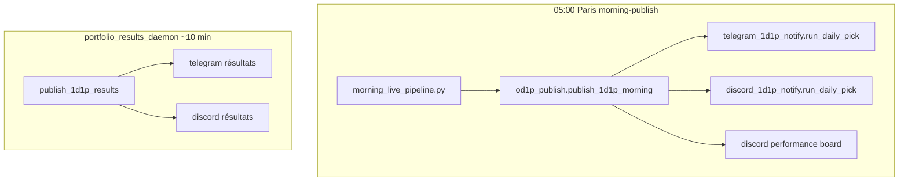

# 1 Day 1 Pick (1pick1day) — référence complète

Pick **unique par jour** : **meilleur pick (rang 1)** de la sélection hybride Top 5 — même règles que `/top5`.  
Track record public auditable : [courtalpha.tech/1-day-1-pick](https://courtalpha.tech/1-day-1-pick).

> **Langue canaux** : Telegram & Discord en **anglais** ([[COMMS_LOCALE]]). Web FR + EN.

---

## 1. Règle de sélection

| Étape | Règle |
|-------|--------|
| Pool | Même sélection que **Top 5 hybride** (voir [[HYBRID_PICK_SELECTION]]) |
| Proba | Favori modèle **≥ 77 %** |
| EV | Tier 1 **15–35 %** puis complément tier 2 **30–55 %** (max 6 candidats/jour) |
| Fiabilité | **≥ 85** (repli **≥ 80** si 0 pick ce jour) |
| Écart cote | **book_gap ≤ 30 pp** |
| Pick retenu | **Rang 1** au tri **proba** ↓ (`selection_mode`: `hybrid_best`) |
| Mise théorique | Kelly **0,65** × Brier, plafond 15 % BR |

> **Juillet 2026** : remplace l’ancienne règle « 1er EV par circuit ATP/WTA + repli EV+ si p &lt; 70 % ».

**Republication** après changement de règle :
```bash
/opt/bettinghud/venv/bin/python scripts/repost_1d1p_today.py --apply
```
(Discord + canal TG public + bot `/1pick1day` — supprime les posts du jour puis reposte.)

**Code unifié** : `scripts/pick_modes.py` (`PickMode.ONE_PICK_ONE_DAY`) → web, Telegram, Discord.

| Couche | Fichier |
|--------|---------|
| Sélection hybride | `scripts/hybrid_pick_selection.py` → `select_hybrid_picks()` |
| Top 5 pool | `scripts/daily_top_proba_store.py` → `collect_hybrid_proba_picks()` |
| 1D1P live | `scripts/discord_1d1p_core.py` → `load_1d1p_today_pick()` (rang 1) |
| Unifié | `scripts/pick_modes.py` (`PickMode.ONE_PICK_ONE_DAY`, `TOP5`) |
| Replay / stats | `CourtAlpha/api/services/one_day_one_pick.py` — historique DB ; **aujourd'hui = live hybride** (comme Top 5) |
| Dédup snapshot TE | `scripts/daily_top_proba_store.py` → `dedupe_top_proba_rows_by_match()` |

---

## 2. Canaux de publication

### 2.1 Web (CourtAlpha)

| | |
|---|---|
| URL | `/1-day-1-pick`, `/en/1-day-1-pick`, archives `/1-day-1-pick/archive/YYYY-MM` |
| API | `GET /api/picks/one-day-one-pick` |
| Affichage | Pick du jour (carte) + **historique date ↓** (récent en haut) + courbe bankroll |
| Courbe | Ordre chronologique (calcul bankroll correct) |

> **Correctif juillet 2026 (prod)** : verrou publication sur `daily_top_proba_picks`.  
> Une fois un rang capturé le matin (`first_captured_ts >= 05:00` Paris), les passes intraday (`portfolio_results_daemon`, `live_data_daemon`, `live_snapshot`, etc.) **ne peuvent plus remplacer** le match publié à ce rang.  
> Archive append-only conservée : `data/exports/daily_top_proba/{date}.jsonl`.

### 2.2 Telegram

| Moment | Déclencheur | Détail |
|--------|-------------|--------|
| **05:00 Paris** | `od1p_publish.py` via `morning_live_pipeline.py --morning-publish` | Pick du jour **broadcast** (tous chats approuvés) + bouton **Bet** |
| **~10 min** | `portfolio_results_daemon.py` → `publish_1d1p_results()` | Résultat Gagné / Perdu / Annulé |
| **Manuel** | `/1pick1day` · `/1d1p` (bot) | Même pick, mode interactif |

**Variables** (`.env` prod) :

```env
TELEGRAM_1D1P_ENABLED=1          # défaut : oui si TELEGRAM_TOP5_AFTER_MORNING=1
TELEGRAM_BOT_TOKEN=…
TELEGRAM_CHAT_ID=…                 # admin + base broadcast
TELEGRAM_ACCESS_ETA_HOURS=24       # délai affiché aux demandes d'accès
SUPPORT_EMAIL=…                    # optionnel — contact pendant attente
```

**UX bot** (depuis juin 2026) :
- Menu clavier : `🎯 1 Day 1 Pick` · `📊 Top 5` · `📅 Today` · `💰 Bankroll` · `❓ Help` · `📖 Strategy`
- Menu `/` natif (`setMyCommands` au démarrage du daemon)
- Onboarding accès : message clair + lien web track record + bouton inline
- **Âge des cotes** visible sur chaque pick (`format_snapshot_freshness_line`)

**Anti-doublon** : table `telegram_1d1p_posts` (`scripts/telegram_1d1p_post_log.py`).

### 2.3 Discord

| Moment | Détail |
|--------|--------|
| **05:00 Paris** | Embed pick (ou « no value ») + mise à jour **track record** (message édité) |
| **~10 min** | Embed résultat + refresh track record |

**Variables** :

```env
DISCORD_1D1P_WEBHOOK_URL=…         # salon dédié 1pick1day uniquement
DISCORD_1D1P_ENABLED=1
DISCORD_1D1P_CHANNEL_ID=…          # pour pin auto (optionnel)
DISCORD_BOT_TOKEN=…                # pin auto (optionnel — sinon pin manuel)
```

**Track record** : un seul message « 📊 Track Record » créé puis **édité** chaque jour (webhooks ne peuvent pas épingler sans bot).

**Anti-doublon** : table `discord_1d1p_posts` (`scripts/discord_1d1p_post_log.py`).

Voir [[DISCORD_1D1P]] pour le détail Discord.

---

## 3. Orchestration



| Script | Rôle |
|--------|------|
| `scripts/od1p_publish.py` | Point d'entrée matin + résultats (TG + Discord) |
| `scripts/telegram_1d1p_notify.py` | CLI / logique publish Telegram |
| `scripts/discord_1d1p_notify.py` | CLI / logique publish Discord |
| `scripts/morning_live_pipeline.py` | Cron 02:00 build · **05:00** `--morning-publish` |
| `scripts/portfolio_results_daemon.py` | Résultats après settlement |

**Commandes manuelles** :

```bash
# Les deux canaux — pick du jour
/opt/bettinghud/venv/bin/python scripts/od1p_publish.py  # via publish_1d1p_morning en Python

/opt/bettinghud/venv/bin/python scripts/telegram_1d1p_notify.py
/opt/bettinghud/venv/bin/python scripts/discord_1d1p_notify.py

# Résultats en attente
/opt/bettinghud/venv/bin/python scripts/telegram_1d1p_notify.py --results
/opt/bettinghud/venv/bin/python scripts/discord_1d1p_notify.py --results

# Track record Discord seul
/opt/bettinghud/venv/bin/python scripts/discord_1d1p_notify.py --performance-board
```

---

## 4. Données & replay

| Source | Table / fichier |
|--------|-----------------|
| Classement journalier | `daily_top_proba_picks` (top 15 ATP/WTA/jour) |
| Clé pick | `pick_key = {calendar_date}\|{tour}\|{rank:02d}` |
| JSONL archive | `data/exports/daily_top_proba/{date}.jsonl` |
| Settlement | `sync_daily_top_proba_from_results()` |

**Déduplication** : le snapshot TE peut lister le même match avec des `match_id` différents → une seule entrée par identité (joueurs + tournoi + date + circuit) avant classement.

**Ordre d'affichage historique** : **date décroissante** (récent en haut) dans l'API replay ; courbe bankroll reste chronologique.

Détail stockage : [[DAILY_TOP_PROBA_REPLAY]].

---

## 5. Cron PROD

Fichier : `deploy/cron/morning-pipeline` → `/etc/cron.d/bettinghud-morning-pipeline`

| Heure (Paris) | Commande | 1D1P |
|---------------|----------|------|
| 02:00 | `--build-only` | — |
| 02:00 | `--build-only` | préparation snapshot (pas de publication) |
| **05:00** | `--morning-publish` | build + **Top 5 + pick TG + Discord + canal** |

Planning global : [[SCHEDULE_MISES_A_JOUR]].

---

## 6. Dépannage

| Symptôme | Cause probable | Action |
|----------|----------------|--------|
| Pas de pick TG/Discord le matin | Cron 05:00 ou `TELEGRAM_1D1P_ENABLED=0` | Logs `morning_publish_cron.log` |
| `already_posted` | Normal (anti-doublon) | `--force` en test seulement |
| Résultat manquant | Pick non journalisé (`daily_pick` + `pick_key`) | Vérifier `telegram_1d1p_posts` / `discord_1d1p_posts` |
| Pick web ≠ TG | Snapshot âge différent | Comparer `snapshot_age_min` ; publications 05:00 |
| Doublon match dans pool | Ancien snapshot TE | Dédup actif ; attendre prochain daemon top-proba |
| Discord pin absent | Pas de `DISCORD_BOT_TOKEN` | Pin manuel du message track record |

Ops général : [[OPS_PROD_DEPANNAGE]].

---

## 7. Tests

| Fichier | Couverture |
|---------|------------|
| `tests/test_1d1p_selection.py` | Fall-through EV, dédup snapshot, tie-break ATP |
| `tests/test_telegram_menu_freshness.py` | Menu clavier, fraîcheur cotes, EV ≥ 15 % |

---

## Liens

- [[TELEGRAM_TOP5]] — bot Telegram complet
- [[DISCORD_1D1P]] — Discord détail
- [[DAILY_TOP_PROBA_REPLAY]] — persistance & replay
- [[COMMS_LOCALE]] — anglais TG/Discord
- [[WEB_REACT]] — pages CourtAlpha
