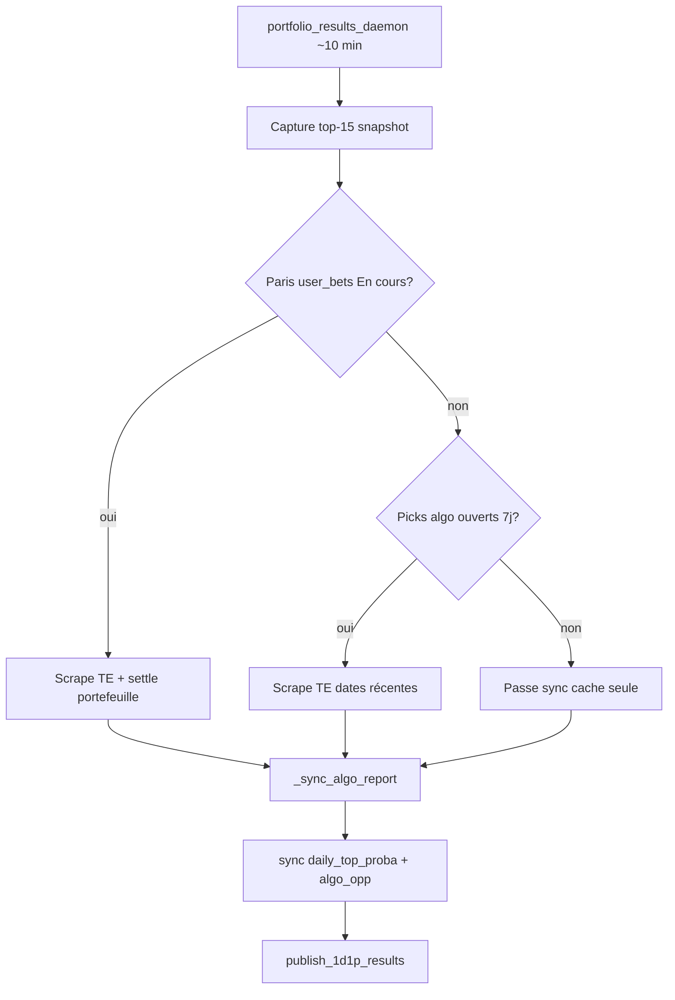

# Picks publiés & résolution algo — juillet 2026

Deux correctifs complémentaires pour la cohérence **publication matin → replay web → settlement soir**.

---

## 1. Replay CourtAlpha : picks réellement publiés

### Problème

| Couche | Comportement avant correctif |
|--------|------------------------------|
| **Publication ~05:38** | Live hybride : ex. Droguet + Hanfmann (fallback rel≥80) |
| **Archive `daily_top_proba_picks`** | Pool top-15 + captures intraday (Vacherot rel=100 capturé à 00:21) |
| **Replay web** | Rejouait `select_hybrid_picks()` sur l’archive → **Vacherot seul** |

Le fallback rel≥80 ne se déclenche que si **0 pick** à rel≥85. L’archive conservait Vacherot → 1 pick → pas de fallback → historique faux.

### Solution

**Table `daily_published_picks`** — snapshot au moment de l’envoi Telegram :

| Colonne | Rôle |
|---------|------|
| `calendar_date`, `mode` | Jour + `top5` ou `1d1p` |
| `publish_rank` | Ordre affiché (1…6) |
| `pick_key` | Lien vers `daily_top_proba_picks` |
| `published_ts`, `publish_source` | Horodatage + `morning-sync`, etc. |
| champs snapshot | fav, EV, rel, cotes (secours si pick_key absent) |

**Écriture automatique** :

| Moment | Script | Mode |
|--------|--------|------|
| Top 5 matin (~05:00–06:00) | `telegram_top5_notify.run_notify()` | `top5` |
| 1D1P matin | `telegram_1d1p_notify.run_daily_pick()` | `1d1p` |
| Commande bot `/top5` (prod) | idem `run_notify()` | `top5` |

Pas d’écriture en `--dry-run` ni preflight.

**Lecture replay** (CourtAlpha) :

- Historique : `load_published_replay_picks()` si lignes existent pour le jour
- Sinon : repli re-sélection hybride (comportement legacy)
- **Aujourd’hui** : toujours live (`load_picks`) — inchangé

### Backfill ponctuel

```bash
py -3 scripts/backfill_published_picks.py --date 2026-07-22
```

### Fichiers

| Fichier | Rôle |
|---------|------|
| `scripts/published_picks_store.py` | Schéma, save, load, sélection historique |
| `scripts/backfill_published_picks.py` | Backfill manuel |
| `CourtAlpha/api/services/top5_replay.py` | Replay Top 5 |
| `CourtAlpha/api/services/one_day_one_pick.py` | Replay 1D1P |

---

## 2. Résolution résultats sans pari portefeuille

### Problème

Le daemon `portfolio_results_daemon` **ignorait le scrape Tennis Explorer** quand `user_bets` = 0 paris « En cours ». Les picks algo (`daily_top_proba_picks`) restaient « En cours » le soir (matchs finis non résolus).

### Solution

| Condition | Action daemon (~10 min) |
|-----------|-------------------------|
| Paris portefeuille en cours | Scrape TE + settle `user_bets` (inchangé) |
| **0 pari portefeuille** mais picks algo ouverts (7 j) | Scrape TE pour dates ouvertes + sync cache |
| Aucun des deux | Sync cache existant uniquement (pas de scrape) |

**Scraper** (`scraper_results.py`) :

- `open_algo_resolution_dates()` — dates `match_date` des picks/journal ouverts (**fenêtre 7 j**, pas tout l’historique stale)
- `OPEN_PICK_TE_FORCE_DAYS = 2` — refresh TE forcé seulement sur **aujourd’hui + hier** (évite 26 dates × 1 min en prod)
- Puis `sync_daily_top_proba_from_results()` / `sync_algo_opportunities_from_results()` via `_sync_algo_report()`

### Flux daemon (simplifié)



### Tables impliquées

| Table | Rôle settlement |
|-------|-------------------|
| `match_results` | Cache TE + Sackmann |
| `daily_top_proba_picks` | Statut Gagné/Perdu favori |
| `algo_opportunities` | Journal value bets |
| `user_bets` | Portefeuille perso |
| `daily_published_picks` | **Replay only** — statut lu via `pick_key` |

---

## 3. Cohérence avec les autres daemons

| Composant | Interaction | Conflit ? |
|-----------|-------------|-----------|
| **`portfolio_results_daemon`** | Capture top-15 + scrape + sync | Non — verrou publication sur `pick_key` inchangé |
| **`live_data_daemon`** | Capture snapshot UI | Non — n’écrase pas rang publié ≥ 05:00 |
| **Pipeline matin 05:00** | `run_notify` → **écrit `daily_published_picks`** | Aligné |
| **`telegram_bot_daemon`** | `/top5` → `run_notify` | Écrase publication du jour si renvoi manuel (voulu) |
| **CourtAlpha API** | Lit DB BettingHUD + `published_picks_store` | Déployer les deux repos |
| **Void stale 14j** | `_void_stale_open_daily_top_proba` | Réduit picks fantômes >14j |

### Logs à surveiller

```bash
# Scrape algo sans portefeuille
grep "pick(s) algo ouvert" /opt/bettinghud/data/logs/portfolio_results_daemon.log

# Top-proba résolus
grep "top-proba résolus" /opt/bettinghud/data/logs/portfolio_results_daemon.log

# Archive publication
sqlite3 /opt/bettinghud/data/bettinghud.db \
  "SELECT calendar_date, mode, publish_rank, fav_player FROM daily_published_picks ORDER BY 1 DESC, 2, 3 LIMIT 20;"
```

### Pièges évités

1. **Re-scrape 26 dates** — fenêtre 7j + force TE 2j seulement  
2. **Replay ≠ publication** — table dédiée, pas re-hybrid sur archive  
3. **Dry-run pollue DB** — pas de save published en dry-run  
4. **Pick_key manquant** — résolution par `fav_player` + `calendar_date` à l’archive  

---

## 4. Déploiement

```bash
# BettingHUD
scp scripts/published_picks_store.py scripts/scraper_results.py \
    scripts/portfolio_results_daemon.py scripts/telegram_top5_notify.py \
    scripts/telegram_1d1p_notify.py bettinghud:/opt/bettinghud/scripts/
sudo systemctl restart bettinghud-daemon

# CourtAlpha
scp api/services/top5_replay.py api/services/one_day_one_pick.py \
    bettinghud:/opt/courtalpha/api/services/
sudo systemctl restart courtalpha-api
```

### Tests (PREPROD)

```bash
py -3 -m pytest tests/test_open_algo_resolution.py tests/test_published_picks_store.py -q
# Sur Windows si teardown pytest : ajouter --capture=no
```

Voir aussi : [[DAILY_TOP_PROBA_REPLAY]], [[ONE_DAY_ONE_PICK]], [[PORTFOLIO_TRACKING]], [[OPS_PROD_DEPANNAGE]] § replay.

---

## 4. Ledger portfolio théorique (juillet 2026)

En plus de `daily_published_picks`, le suivi **reconstructible** Top5 / 1D1P utilise :

- `portfolio_tracking_config` — date de départ + bankroll théorique par mode
- `portfolio_daily_bets` — une ligne par pari publié avec Kelly / P/L / bankroll

Alimentation : hooks sur publication TG et settlement algo. CourtAlpha lit ce ledger quand la config est active.

Détail complet : [[PORTFOLIO_TRACKING]].
