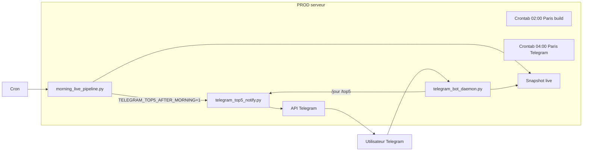

# Bot Telegram CourtAlpha — documentation complète

Bot **CourtAlpha** (display name) · username **@CourtAlphabot** : notifications et commandes sur le **serveur PROD uniquement**.  
PREPROD (PC local) : prévisualisation `--dry-run` seulement, pas d’envoi réel.

> **1 Day 1 Pick (auto + manuel)** : [[ONE_DAY_ONE_PICK]] — publication **05:00** + résultats daemon.  
> **Langue des messages** : **anglais** (Telegram bot + canal public). Voir [[COMMS_LOCALE]].  
> Voir aussi : [[ENVIRONNEMENTS]] · [[DEPLOY_SERVEUR]] · [[OPS_PROD_DEPANNAGE]] · [[ARCHITECTURE_ACTUELLE_ET_MISES]]

---

## 1. Vue d’ensemble

| Fonction | Déclencheur | Contenu |
|--------|-------------|---------|
| **1 Day 1 Pick matinal** | **05:00** `od1p_publish` (`TELEGRAM_1D1P_ENABLED=1`) | Pick unique/jour · broadcast · bouton **Bet** · résultats via daemon |
| **Top 5 matinal** | **05:00** (`TELEGRAM_TOP5_AFTER_MORNING=1`) | Top 5 **hybride** · P≥77 % · rel≥75 · gap≤30 pp · EV tier1/tier2 · tri EV ↓ |
| **`/1pick1day`** · **`/1d1p`** | Commande ou menu **🎯 1 Day 1 Pick** | Même pick que web · interactif + Bet |
| **`/jour`** · **`/today`** | Menu **📅 Today** ou commande | Matchs **Aujourd’hui** · **proba > 60 %** · **EV ≥ 15 %** (tri proba ↓) |
| **`/jourchallenger`** | Commande Telegram | Tournois **Challenger** ATP/WTA du jour · EV **+15 % → +100 %** · tri **proba** ↓ |
| **`/jourmajor`** | Commande Telegram | Tournois **main draw 250+** du jour · EV **+15 % → +100 %** · tri **proba** ↓ |
| **`/top5`** | Commande Telegram | Même logique que le Top 5 matinal, à la demande |
| **`/start`**, **`/help`** | Commandes Telegram | Bienvenue et aide |
| **`/strategie`** | Commande Telegram | Résumé stratégie sélection + mise (Kelly) |
| **`/br`**, **`/brstats`** | Commandes Telegram | Bankroll utilisateur (synthèse / stats avancées) |
| **Parier (inline)** | Bouton sous chaque pick **`/jour`**, **`/top5`** et **Top 5 matinal** | Cote perso → Kelly → confirmation → `user_bets` (`tracker_source=telegram_bet`) |

> **Historique web CourtAlpha (juillet 2026)** : pour aligner l'historique avec les publications Telegram/Discord du matin, le replay Top5/1D1P prend la capture JSONL append-only de référence du jour (première capture `>= 05:00` Paris), puis synchronise le statut via SQL.



---

## 2. Fichiers du dépôt

| Fichier | Rôle |
|---------|------|
| `scripts/telegram_top5_notify.py` | Formatage HTML, envoi messages, `run_notify`, `run_1d1p_notify`, menu clavier |
| `scripts/telegram_1d1p_notify.py` | Publication auto 1D1P (matin + résultats broadcast) |
| `scripts/telegram_1d1p_post_log.py` | Journal anti-doublon `telegram_1d1p_posts` |
| `scripts/od1p_publish.py` | Orchestration 1D1P Telegram + Discord |
| `scripts/telegram_bot_daemon.py` | Long polling `getUpdates`, commandes + callbacks « Parier » + `setMyCommands` |
| `scripts/telegram_access.py` | Demandes d'accès, onboarding, broadcast chats |
| `scripts/telegram_bet_flow.py` | Sessions cote/Kelly, registre picks (`threading.Lock`) |
| `scripts/live_tracker_picks.py` | Collecte headless des picks **Live Tracker (Aujourd’hui)** pour `/jour` |
| `scripts/hybrid_pick_selection.py` | Logique hybride partagée Top 5 + 1D1P |
| `scripts/daily_top_proba_store.py` | `collect_hybrid_proba_picks` — Top 5 prod |
| `scripts/morning_live_pipeline.py` | **02:00** `--build-only` · **05:00** `--morning-publish` (Top 5 + 1D1P + canal si flags activés) |
| `deploy/systemd/bettinghud-telegram-bot.service` | Service systemd daemon commandes |
| `deploy/install_ubuntu.sh` | Installe et active le service Telegram |

**Logs PROD**

| Log | Contenu |
|-----|---------|
| `data/logs/telegram_bot_daemon.log` | Polling, commandes reçues, erreurs |
| `data/logs/morning_pipeline_cron.log` | Cron pipeline matin |
| `data/cache/logs/morning_pipeline_*.log` | Détail par exécution pipeline |

**État daemon**

| Fichier | Rôle |
|---------|------|
| `data/cache/.telegram_bot_offset` | Dernier `update_id` Telegram (reprise après redémarrage) |

---

## 3. Logique métier : `/jour` vs `/top5`

### 3.1 `/jour` — Live Tracker (Aujourd’hui)

Même pool de matchs que le Live Tracker (**Aujourd’hui**), filtrés **proba modèle > 60 %** et **EV > 15 %** (`filter_telegram_display_picks`).

**Matchs scannés** (via `scripts/daily_top_proba_store.collect_top5_proba_picks`) :

1. Snapshot live du jour (`load_today_matches_for_daily_top_proba`)
2. Cotes valides (`odd_p1`, `odd_p2` > 1)
3. Rang/points fiables sur les deux joueurs
4. **Gros tournois ATP/WTA uniquement** (`is_major_atp_wta_match` — hors Challenger, ITF, UTR, futures)
5. Calendrier **aujourd’hui** (Europe/Paris)
6. Match à venir ou démarré depuis moins de `BETTINGHUD_LIVE_STARTED_GRACE_MINUTES` (défaut **90** min) — pour `/jour` via `live_tracker_picks`

**Lignes affichées** :

- Uniquement les côtés avec **EV strictement positive** (`ValueDetector`, seuil min défaut **0 %**)
- Seuils affichage : `TELEGRAM_MIN_PROBA_PCT=60`, `TELEGRAM_MIN_EV_PCT=15` (strictement `>`)
- **Fiabilité data** : `data_reliability_score ≥ 80` (`BETTINGHUD_MIN_DATA_RELIABILITY`, voir `docs/DATA_RELIABILITY.md`)
- Scan initial : `TELEGRAM_JOUR_EV_MIN_PCT=15` (défaut)

**Pas de ligne** sur le favori modèle si EV ≤ 0.

**Tri** : score **priorité composite** (Sharpe / Brier × qualité segment).

**Champs affichés** (message Telegram HTML) :

| Champ | Source |
|-------|--------|
| Joueur parié vs adversaire | Côté retenu |
| Circuit · tournoi · heure | Match snapshot |
| Proba modèle | `capped_p1_prob` via `model_prob_for_side` (aligné Top 5 — plus `1 / true_odd` stale) |
| EV | `ValueDetector` |
| Cote | Cote book du côté parié |
| Kelly reco | `_algo_kelly_stake_frac` (Kelly 0,65 × Brier adaptatif) |

Messages longs : découpés automatiquement (~3900 caractères / message) avec en-tête « Partie 1/2 ».

### 3.2 `/jourchallenger` — Challengers du jour

Alias : `/challengers`.

| Critère | Valeur |
|---------|--------|
| Tournois | `is_challenger_tier_match` : `category=Challenger`, nom/url **challenger**, ou **points vainqueur &lt; 250** (ex. Foggia WTA 125) |
| Jour | **Aujourd’hui** (même hygiène que `/jour`) |
| EV | **+15 % → +100 %** (`TELEGRAM_JOURCHALLENGER_EV_MIN_PCT` / `_MAX_PCT`) |
| Tri | **Proba modèle** décroissante (pas priorité composite) |

Fonction : `load_live_tracker_challenger_day_picks` dans `scripts/live_tracker_picks.py`.

Prérequis : snapshot live incluant les Challengers (build matin ou rebuild). Voir **`docs/CHALLENGERS_ET_TOURNOIS.md`**.

### 3.3 `/jourmajor` — Majors 250+ du jour

Alias : `/majors`.

| Critère | Valeur |
|---------|--------|
| Tournois | `is_major_tournament_match` : main draw ATP/WTA **250+** (hors Challenger, WTA 125, ITF) |
| Jour | **Aujourd’hui** (même hygiène que `/jour`) |
| EV | **+15 % → +100 %** (`TELEGRAM_JOURMAJOR_EV_MIN_PCT` / `_MAX_PCT`) |
| Tri | **Proba modèle** décroissante |

Fonction : `load_live_tracker_major_day_picks` dans `scripts/live_tracker_picks.py`.

### 3.4 `/top5` et envoi matinal — sélection hybride

Aligné backtest juillet 2026 — voir **`docs/HYBRID_PICK_SELECTION.md`**.

| Critère | Valeur |
|---------|--------|
| Tournois | **Majors ATP/WTA** uniquement (`is_major_atp_wta_match`) |
| Proba | Favori modèle **≥ 77 %** |
| EV tier 1 | **+15 % → +30 %** (inclus) — remplissage prioritaire |
| EV tier 2 | **+30 % → +50 %** (30 exclus, 50 inclus) — complément si &lt; 5 picks |
| Fiabilité | `data_reliability_score ≥ 75` |
| Gap book | **≤ 30 pp** |
| **Exclusion dup** | Pas de publication si **`duplicate_model_prob`** |
| Tri | EV favori ↓ |
| Limite | **5** matchs (`TELEGRAM_TOP5_LIMIT`) |

Fonctions : `collect_hybrid_proba_picks` · `select_hybrid_picks` (+ `filter_telegram_display_picks` pour Telegram).

**1 Day 1 Pick** : même sélection, **rang 1** uniquement ([[ONE_DAY_ONE_PICK]]).

### 3.5 Parier depuis Telegram (`/jour`, `/top5`, Top 5 matinal)

Sur demande via le daemon **ou** sur l’envoi matinal automatique (`run_notify(..., interactive=True)`) :

1. Un **message par match** avec bouton **💰 Parier**
2. Clic → le bot demande ta **cote réelle** (ex. `1.92`)
3. Calcul **Kelly 0,65 × Brier** sur la bankroll app (comme le dashboard)
4. **✅ Confirmer** (mise Kelly), **✏️ Autre mise**, ou envoi d’un montant en € (ex. `2.50`)
5. Cumul autorisé sur le même match ; insertion `user_bets` (`tracker_source=telegram_bet`)

> **Juin 2026** : les liens **Winamax** sous les picks ont été **retirés** (bouton unique **💰 Parier**). Le cache Winamax n’est plus rafraîchi dans le pipeline matin.

Annuler une saisie en cours : `/annuler`.

**Bankroll par utilisateur Telegram** (identifiant `from.id`, pas le `chat_id`) :

| Commande | Action |
|----------|--------|
| `/br` | Synthèse BR : dispo, engagée, capital total, P/L réglé |
| `/brstats` | Stats avancées (ROI, win rate, forme, 7 j, par source, paris en cours) |
| `/brset 80` | Capital de départ (€) |
| `/brajust +10` | Ajustement manuel (+ ou −) |

Alias `/brstats` : `/bradv`, `/brdetail`.

Kelly par **utilisateur Telegram** (`from.id`) : tous les paris rattachés à ton `telegram_user_id` (dashboard **Miouppy** + paris bot). Capital de départ et ajustements sont **par compte**, pas globaux au chat.

État temporaire : `data/cache/telegram_pick_registry.json`, `data/cache/telegram_bet_sessions.json` (TTL 24 h).

---

## 4. Commandes Telegram

| Commande | Alias | Action |
|----------|-------|--------|
| `/start` | — | Message de bienvenue + liste des commandes |
| `/help` | — | Aide détaillée |
| `/jour` | `/picks`, `/picksdujour` | **Aujourd’hui** · proba > 60 % · EV > 15 % |
| `/jourchallenger` | `/challengers` | Challengers + WTA 125 · EV 15–100 % · tri proba ↓ |
| `/jourmajor` | `/majors` | Main draw 250+ · EV 15–100 % · tri proba ↓ |
| `/top5` | `/top` | Top 5 hybride main draw (P≥77 %, rel≥75, gap≤30 pp, EV tiers 15–30 / 30–50 %, tri EV ↓) |
| `/strategie` | `/strategy` | Stratégie BettingHUD + mise Kelly (synthèse) |
| `/br` | — | Bankroll utilisateur (synthèse) |
| `/brstats` | `/bradv`, `/brdetail` | Bankroll avancée (ROI, forme, historique) |
| `/brset` | — | Capital de départ (`/brset 80`) |
| `/brajust` | — | Ajustement manuel (`/brajust +10`) |
| `/annuler` | `/cancel` | Annule une saisie de cote en cours (flux Parier) |

**Sécurité** : seuls les `chat_id` listés dans `TELEGRAM_CHAT_ID`, `TELEGRAM_ALLOWED_CHAT_IDS` ou le fichier d’approbation dynamique peuvent utiliser le bot.

### 4.0 Demandes d’accès (`/start` non autorisé)

| Étape | Comportement |
|-------|----------------|
| Bot ajouté / premier contact | Invitation explicite **`/start`** (ou bouton **Démarrer**) |
| Inconnu envoie **`/start`** (ou un message) | Demande transmise à l’admin |
| Toi (`TELEGRAM_CHAT_ID`) | Notification avec **✅ Approuver** / **❌ Refuser** |
| **Approuver** | Accès immédiat + **3 messages** : confirmation, bienvenue, guide pratique (`/brset`, `/top5`, Parier, `/help`…) |
| Utilisateur déjà autorisé · `/start` | Bienvenue + rappel `/help` et `/strategie` |

Anti-spam admin : une seule notification par `chat_id` / heure (sauf si déjà approuvé).

Variables optionnelles : `TELEGRAM_ADMIN_USER_ID` ou `TELEGRAM_ADMIN_USER_IDS` (défaut = `TELEGRAM_CHAT_ID`).

Fichier : `scripts/telegram_access.py`.

### 4.1 `/strategie` — contenu

Message statique (`format_bot_strategy_message` dans `telegram_top5_notify.py`) :

1. **Principe** — modèle ML ATP/WTA, edge vs book (EV &gt; 0)
2. **Sélection** — `/top5` & `/1pick1day` : hybride P≥77 %, rel≥75, gap≤30 pp, EV tier1 15–30 % + tier2 30–50 %, tri EV ↓ (max 5/j) ; `/today` : value bets EV≥15 %
3. **Mise** — Kelly 0,65, facteur Brier segment, plafond 15 % BR
4. **Pratique** — vérifier cote réelle, miser ≤ reco Kelly

Aperçu PREPROD : `py -3 scripts/telegram_top5_notify.py --strategy`

### 4.2 `/brstats` — contenu

Message HTML (`format_telegram_user_br_advanced_message` dans `telegram_bet_flow.py`) :

1. **Synthèse** — capital départ, BR dispo, engagé (% du capital), equity, P/L, vs capital départ, ajustement manuel
2. **Performance réglés** — volume, G/P/A, win rate, mises réglées, ROI, cotes moyennes gagnés/perdus
3. **Forme** — 10 derniers paris réglés (✅/❌)
4. **Par source** — Telegram, Live Tracker, Paris du jour, etc.
5. **7 derniers jours** — P/L et volume par date
6. **En cours** — jusqu’à 5 plus grosses mises ouvertes

Données : `compute_telegram_user_br_advanced_stats` dans `scripts/bets_db.py`.

---

## 5. Configuration PROD

### 5.1 Créer le bot

1. Telegram → **@BotFather**
2. `/newbot` → nom + username (ex. `@CourtAlphabot`)
3. Copier le **token** (ne jamais le committer)

### 5.2 Obtenir le chat ID

1. Envoyer `/start` au bot
2. `https://api.telegram.org/bot<TOKEN>/getUpdates`
3. Repérer `"chat":{"id":123456789}`

### 5.3 Fichier `.env` sur le serveur

Chemin : **`/opt/bettinghud/.env`** (permissions `600`, dans `.gitignore`)

```env
BETTINGHUD_ENV=prod

# Obligatoire
TELEGRAM_BOT_TOKEN=123456789:AA...
TELEGRAM_BOT_USERNAMES=CourtAlphabot
TELEGRAM_CHAT_ID=123456789

# Envoi Top 5 après pipeline matin
TELEGRAM_TOP5_AFTER_MORNING=1

# Top 5 (Paris du jour)
TELEGRAM_TOP5_LIMIT=5
TELEGRAM_TOP5_EV_MIN_PCT=15
TELEGRAM_TOP5_EV_MAX_PCT=100

# /jour — limite optionnelle (0 = tous les picks EV+)
TELEGRAM_JOUR_EV_MIN_PCT=15
TELEGRAM_MIN_PROBA_PCT=60
TELEGRAM_MIN_EV_PCT=15
TELEGRAM_DAILY_PICKS_LIMIT=0

# Chats autorisés pour /jour et /top5 (optionnel, virgules)
# TELEGRAM_ALLOWED_CHAT_IDS=123456789,987654321

# Polling daemon (optionnel)
# TELEGRAM_BOT_POLL_TIMEOUT_SEC=15
# TELEGRAM_UPDATE_WORKERS=3
```

### 5.4 Variables d’environnement (référence)

| Variable | Défaut | Usage |
|----------|--------|--------|
| `TELEGRAM_BOT_TOKEN` | — | Token @BotFather |
| `TELEGRAM_BOT_USERNAMES` | `CourtAlphabot` | Username(s) pour liens `t.me` et commandes en groupe |
| `TELEGRAM_CHAT_ID` | — | Chat principal (notifications + commandes) |
| `TELEGRAM_ALLOWED_CHAT_IDS` | — | Liste additionnelle de chats autorisés |
| `TELEGRAM_TOP5_AFTER_MORNING` | `0` | `1` = Top 5 à **05:00** via `morning_live_pipeline.py --morning-publish` |
| `TELEGRAM_TOP5_LIMIT` | `5` | Nombre de picks Top 5 |
| `TELEGRAM_TOP5_EV_MIN_PCT` | `15` | EV min favori (Top 5) |
| `TELEGRAM_TOP5_EV_MAX_PCT` | `100` | EV max favori (Top 5) |
| `TELEGRAM_DAILY_PICKS_LIMIT` | `0` | Max lignes `/jour` (`0` = illimité) |
| `TELEGRAM_BOT_POLL_TIMEOUT_SEC` | `15` | Timeout long polling `getUpdates` |
| `TELEGRAM_UPDATE_WORKERS` | `3` | Workers parallèles pour `/jour`, `/top5`, `/1d1p` (file d’attente) |
| `BETTINGHUD_LIVE_STARTED_GRACE_MINUTES` | `90` | Matchs démarrés encore inclus (/jour) |
| `BETTINGHUD_LIVE_SNAPSHOT_TTL_SEC` | `86400` | TTL chargement snapshot |

### Réactivité (juin 2026)

- **File d’attente** : `/jour`, `/top5`, `/1d1p` ne bloquent plus le polling (callbacks « Parier » traités en priorité sur le thread principal).
- **`TELEGRAM_UPDATE_WORKERS`** (déf. 3) : plusieurs commandes lourdes en parallèle (un long `/jour` n’empêche pas un autre utilisateur).
- **Accusé immédiat** : message `⏳ Chargement des picks…` avant chargement snapshot/ML ; indicateur « écrit… » sur les commandes lentes.
- **Callback Parier** : spinner Telegram coupé dès le clic (`answerCallbackQuery` immédiat).
- **Cache** (`telegram_runtime_cache.py`) : bundle ML + snapshot jour + picks **Top5 / Today / 1D1P** préchargés au démarrage du bot ; invalidés si le snapshot full change.

Autonomie crons / ML / enrichissement : voir [[CRONS_SEMAINE]] § *Autonomie PROD*.

---

## 6. Déploiement et services PROD

### 6.1 Pipeline matin + Top 5 automatique

Cron : `deploy/cron/morning-pipeline` → `/etc/cron.d/bettinghud-morning-pipeline`

| Heure (Paris) | Commande | Log |
|---------------|----------|-----|
| **02:00** | `morning_live_pipeline.py --build-only` | `data/logs/morning_build_cron.log` |
| **05:00** | `morning_live_pipeline.py --morning-publish` | `data/logs/morning_publish_cron.log` |

- **02:00** : scrape TE, snapshot full, report algo (pas de publication).
- **05:00** : `--morning-publish` — build + si `TELEGRAM_TOP5_AFTER_MORNING=1` et `BETTINGHUD_ENV=prod` → `run_notify(source="morning-sync", interactive=True)` : Top 5 interactif + 1D1P + canal public.

### 6.2 Service daemon commandes

```bash
sudo cp /opt/bettinghud/deploy/systemd/bettinghud-telegram-bot.service /etc/systemd/system/
sudo systemctl daemon-reload
sudo systemctl enable --now bettinghud-telegram-bot
sudo systemctl status bettinghud-telegram-bot
```

Le service charge `EnvironmentFile=-/opt/bettinghud/.env` et force `BETTINGHUD_ENV=prod`.

**Après mise à jour du code** :

```bash
ssh bettinghud "cd /opt/bettinghud && git pull"
ssh bettinghud "sudo systemctl restart bettinghud-telegram-bot"
# Si scripts modifiés sans git :
# scp scripts/telegram_*.py scripts/live_tracker_picks.py bettinghud:/opt/bettinghud/scripts/
```

### 6.3 Mise à jour complète (checklist)

- [ ] `git pull` sur `/opt/bettinghud`
- [ ] Vérifier `/opt/bettinghud/.env` (token, chat_id, `TELEGRAM_TOP5_AFTER_MORNING`)
- [ ] `sudo systemctl restart bettinghud-telegram-bot`
- [ ] Tester `/help` et `/jour` sur Telegram
- [ ] Vérifier `tail -20 /opt/bettinghud/data/logs/telegram_bot_daemon.log`

---

## 7. PREPROD (PC local)

### 7.1 Règles

- **Pas** de token dans un `.env` local commité (inutile pour l’usage normal)
- **Pas** de tâche planifiée Windows pour Telegram
- Envoi réel **bloqué** sauf `--force` (déconseillé)

### 7.2 Prévisualiser les messages

```powershell
cd O:\Miouppy\Documents\BettingHUD

# Top 5 (Paris du jour)
py -3.11 scripts/telegram_top5_notify.py --dry-run

# Live Tracker /jour
py -3.11 scripts/telegram_top5_notify.py --dry-run --daily
```

Sortie console = rendu HTML (émojis, format Telegram).

---

## 8. CLI (scripts)

### `telegram_top5_notify.py`

```bash
# Top 5 — envoi PROD (avec .env chargé)
python scripts/telegram_top5_notify.py

# Top 5 — aperçu
python scripts/telegram_top5_notify.py --dry-run

# /jour — aperçu (Live Tracker)
python scripts/telegram_top5_notify.py --dry-run --daily

# /jour — envoi PROD
python scripts/telegram_top5_notify.py --daily

# Options
python scripts/telegram_top5_notify.py --limit 5 --ev-min-pct 15 --ev-max-pct 100
python scripts/telegram_top5_notify.py --chat-id 123456789 --force   # debug hors prod
```

### `telegram_bot_daemon.py`

```bash
# PROD (via systemd en pratique)
python scripts/telegram_bot_daemon.py

# Une passe de polling (test)
python scripts/telegram_bot_daemon.py --once
```

---

## 9. Format des messages

### Exemple `/jour` (extrait)

```text
📋 BettingHUD · Live Tracker (Aujourd'hui)

📅 ven. 29 mai 2026 · Europe/Paris
🎯 Live Tracker · tous les matchs scannés ↓
📲 Demande manuelle
✅ 12 match(s) · 16 scanné(s) au total
━━━━━━━━━━━━━━━━━━━━

🥇 Joueur A vs Joueur B
   🏟 WTA · Roland Garros · 🕒 14:30
   📊 Proba 68.2% · EV +22.3% · Cote @1.85
   💰 Kelly reco ~4.2% BR
...
```

### Exemple `/top5` (extrait)

```text
🎾 BettingHUD · Top 5 Hybride

📅 ven. 29 mai 2026 · Europe/Paris
📊 P≥77% · EV tier1 15–30% + tier2 30–50% · gap≤30pp · tri EV ↓
🌅 Envoi matinal automatique
...
```

Pied de page commun : *Info — pas un conseil de pari. Vérifier les cotes avant mise.*

---

## 10. Dépannage

| Symptôme | Cause probable | Action |
|----------|----------------|--------|
| Pas de message matinal | `TELEGRAM_TOP5_AFTER_MORNING` absent | Ajouter `=1` dans `.env` |
| Pipeline OK, pas de Telegram | Erreur silencieuse dans pipeline | Lire `morning_pipeline_*.log` |
| `TELEGRAM_BOT_TOKEN requis` | `.env` non chargé par cron | Vérifier `.env` ; pipeline charge dotenv au démarrage |
| `/top5` ne répond pas | Daemon arrêté | `systemctl status bettinghud-telegram-bot` |
| `403 Forbidden` | Pas de `/start` ou mauvais chat_id | `/start` + vérifier `TELEGRAM_CHAT_ID` |
| Chat non autorisé | Mauvais compte Telegram | Ajouter id dans `TELEGRAM_ALLOWED_CHAT_IDS` |
| `/jour` vide, beaucoup scannés | Normal si peu de value / données | Vérifier snapshot : pipeline matin, dashboard Live |
| Message coupé | Trop de matchs | Normal — parties 1/N ; ou `TELEGRAM_DAILY_PICKS_LIMIT` |
| PREPROD bloqué | `BETTINGHUD_ENV != prod` | Attendu — utiliser `--dry-run` |
| Token exposé | Fuite chat / logs | `/revoke` @BotFather + mettre à jour `.env` |

**Commandes diagnostic PROD** :

```bash
sudo systemctl status bettinghud-telegram-bot
tail -30 /opt/bettinghud/data/logs/telegram_bot_daemon.log
cd /opt/bettinghud && source venv/bin/activate && set -a && source .env && set +a
python scripts/telegram_top5_notify.py --dry-run --daily
python scripts/telegram_top5_notify.py --dry-run
```

---

## 11. Sécurité

- Ne **jamais** committer `TELEGRAM_BOT_TOKEN` ni `.env`
- Fichier `.env` serveur : `chmod 600`
- Limiter les `chat_id` autorisés
- En cas de fuite du token : **@BotFather** → `/revoke` → mettre à jour PROD

---

## 12. Liens documentation

| Note | Sujet |
|------|--------|
| [[ENVIRONNEMENTS]] | PREPROD vs PROD, automatisations |
| [[DEPLOY_SERVEUR]] | Installation Ubuntu, cron, systemd |
| [[OPS_PROD_DEPANNAGE]] | Incidents PROD (dont services) |
| [[PROD_RESILIENCE]] | Redémarrage auto systemd |
| [[CHART_TOP_PROBAS_JOUR]] | Top 15 + toggle EV Live Tracker |
| [[BACKTEST_TOP5_PROBA_VS_EV]] | Stratégie Top 5 proba vs EV |
| [[BACKTEST_PROD_TOP5_2025_2026]] | Replay Top 5 **prod réel** 2025/2026, fiabilité, audit |
| [[PREDICTION_ET_MISE]] | Proba, EV, Kelly |
| [[CHANGELOG_RECENT]] | § 0.18 Bot Telegram |
